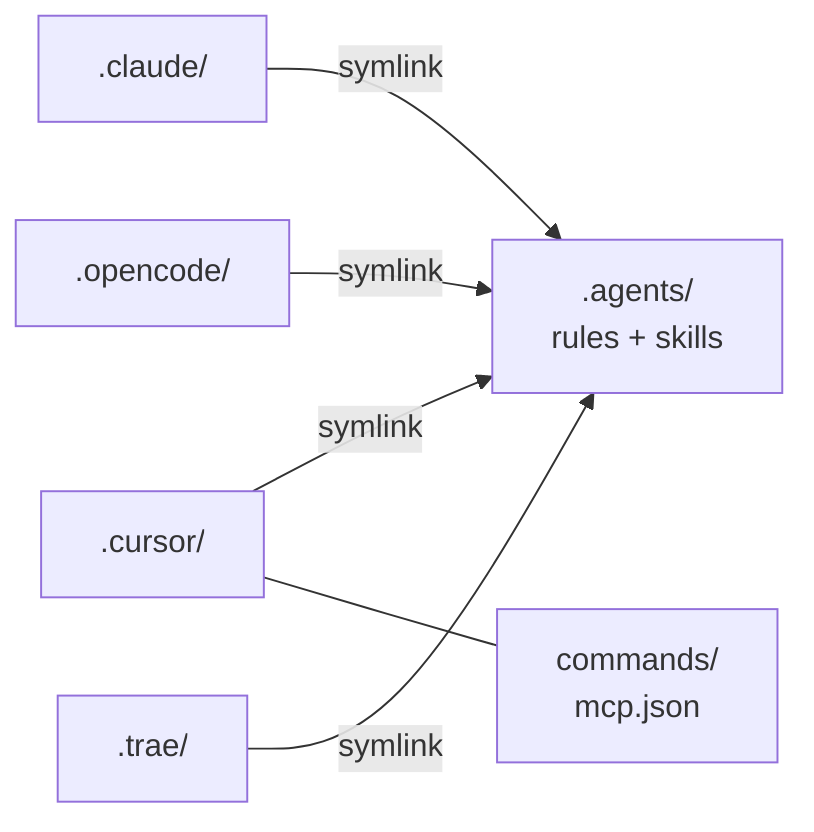
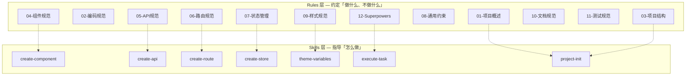
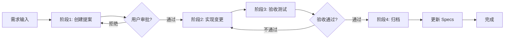
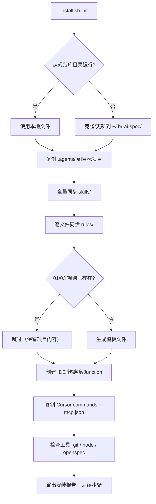

# br-ai-spec

AI Coding 团队规范库 — 让 AI 编码助手遵循统一的开发规范、工作流程和最佳实践。

支持的 AI IDE：**Cursor** | **Claude Code** | **OpenCode** | **Trae**

## 快速开始

### 自动安装（推荐）

克隆本仓库后，一行命令接入你的项目：

```bash
# 克隆规范库
git clone https://github.com/your-org/br-ai-spec.git
cd br-ai-spec

# 安装到你的项目
bash install.sh init /path/to/your-project
```

**Windows PowerShell：**

```powershell
git clone https://github.com/your-org/br-ai-spec.git
cd br-ai-spec
.\install.ps1 init C:\path\to\your-project
```

**远程一行安装（无需手动克隆）：**

```bash
# macOS / Linux
curl -sSL https://raw.githubusercontent.com/your-org/br-ai-spec/main/install.sh | bash -s -- init .

# Windows PowerShell
irm https://raw.githubusercontent.com/your-org/br-ai-spec/main/install.ps1 | iex
```

安装完成后，在 AI IDE 中输入 **"初始化项目规范"** 即可自动分析项目并生成技术栈描述和目录结构规范。

### 脚本命令一览

| 命令 | 说明 |
|------|------|
| `install.sh init [dir]` | 首次接入：复制规范 + 创建链接 + 检查工具 |
| `install.sh update [dir]` | 更新通用规范（不覆盖项目特有规则 01/03） |
| `install.sh check [dir]` | 检查安装状态、链接有效性、工具环境 |
| `install.sh uninstall [dir]` | 卸载规范库 |

可选参数：`--ide cursor` 仅安装特定 IDE 支持，`--repo <url>` 指定自定义仓库地址。

---

## 架构概览

### 核心设计：单源多链接

`.agents/` 是唯一的规范维护源，各 IDE 通过软链接（macOS/Linux）或 Junction（Windows）引用同一份内容：



### 项目目录结构

```
项目根/
├── .agents/                       # 唯一维护源
│   ├── rules/                     # 12 条开发规范（按需加载）
│   │   ├── 01-项目概述.md          #   → 项目定位与技术栈 ★ 需项目自行填写
│   │   ├── 02-编码规范.md          #   → TypeScript、命名、函数
│   │   ├── 03-项目结构.md          #   → 目录规范与约束 ★ 需项目自行填写
│   │   ├── 04~11-*.md             #   → 组件/API/路由/状态/样式/文档/测试
│   │   └── 12-Superpowers执行规范.md  # → 代码执行三道关卡
│   └── skills/                    # 实践技能（AI 行为指令）
│       ├── project-init/          #   → 自动分析项目生成 01/03
│       ├── using-superpowers/     #   → 技能调度核心规范
│       ├── execute-task/          #   → Superpowers 任务执行
│       ├── create-proposal/       #   → 创建开发提案
│       ├── create-component/      #   → 创建/拆分组件
│       ├── create-api/            #   → 创建 HTTP 接口
│       ├── create-route/          #   → 创建页面路由
│       ├── create-store/          #   → 创建 Zustand Store
│       ├── design-analysis/       #   → 设计稿分析
│       ├── ui-verification/       #   → UI 验收
│       ├── theme-variables/       #   → 主题变量使用
│       └── ...                    #   → 更多第三方技能
│
├── .cursor/                       # Cursor IDE 配置
│   ├── rules -> ../.agents/rules  #   软链接
│   ├── skills -> ../.agents/skills#   软链接
│   ├── commands/                  #   OpenSpec 命令
│   └── mcp.json                   #   MCP 服务器配置
├── .claude/                       # Claude Code 配置（软链接）
├── .opencode/                     # OpenCode 配置（软链接）
├── .trae/                         # Trae 配置（软链接）
│
├── openspec/                      # SDD 流程配置（仅 Cursor）
│   ├── project.md                 #   项目上下文
│   ├── config.yaml                #   OpenSpec 配置
│   └── AGENTS.md                  #   AI 使用说明
│
├── install.sh                     # Bash 安装脚本
└── install.ps1                    # PowerShell 安装脚本
```

---

## 规范体系：Rules + Skills

### 两层设计



- **Rules**：声明式规范，告诉 AI「什么能做、什么不能做」。按需加载，不会自动注入每次对话。
- **Skills**：过程式指令，告诉 AI「具体怎么做」。包含步骤、示例代码和检查清单。

---

## SDD 工作流闭环（Spec-Driven Development）

从需求到归档的完整开发闭环，确保 AI 开发过程可追溯、可验收：



### 各阶段详情

| 阶段 | 触发方式 | 核心动作 | 产出物 |
|------|---------|---------|--------|
| **创建提案** | `/openspec-proposal` 或 `create-proposal` skill | 分析需求 → 拆解任务 → 编写 spec delta | `proposal.md` `tasks.md` `design.md` |
| **实现变更** | `/openspec-apply` 或 `execute-task` skill | 头脑风暴 → TDD 编码 → 双重审查 | 实现代码 + 测试 |
| **验收测试** | `ui-verification` skill | 页面截图 vs 设计稿对比 | 验收报告 |
| **归档** | `/openspec-archive` | 移动到 archive + 更新 specs | 规范更新 |

---

## 安装脚本核心流程



---

## 团队接入指南

### 接入步骤

1. **运行安装脚本**：`bash install.sh init /path/to/project`
2. **填写项目信息**：编辑 `01-项目概述.md` 和 `03-项目结构.md`（或在 AI IDE 中说"初始化项目规范"自动生成）
3. **配置 MCP**（仅 Cursor）：修改 `.cursor/mcp.json` 中的 `project-id` 和 `access-token`
4. **验证安装**：`bash install.sh check`
5. **开始使用**：在 AI IDE 中正常对话，AI 会自动按规范执行

### 注意事项

| 事项 | 说明 |
|------|------|
| **项目特有规则** | `01-项目概述.md` 和 `03-项目结构.md` 必须根据项目实际情况填写，update 不会覆盖 |
| **MCP 配置** | `.cursor/mcp.json` 中的 token 和 project-id 是占位符，需替换为实际值 |
| **OpenSpec** | SDD 流程仅 Cursor 支持，其他 IDE 可忽略 `openspec/` 目录 |
| **Windows 链接** | 使用 Junction（`mklink /J`）替代 symlink，无需管理员权限；Git Bash 也可运行 `install.sh` |
| **已有项目** | 如果项目已有 `.cursor/` 等目录，脚本会追加链接，不会删除现有的 `commands/` 或其他配置 |
| **新项目** | 建议先初始化项目（`npm init` / `create-react-app` 等），再运行安装脚本 |
| **规范更新** | 定期运行 `install.sh update` 同步最新通用规范，项目特有规则不受影响 |
| **团队一致性** | 规范库应作为团队标准，所有项目接入同一版本以保证一致性 |

### 各 IDE 的差异

| 特性 | Cursor | Claude Code | OpenCode | Trae |
|------|--------|-------------|----------|------|
| Rules 加载 | `.cursor/rules/` 自动扫描 | `.claude/rules/` 自动扫描 | `.opencode/rules/` | `.trae/rules/` |
| Skills 加载 | `.cursor/skills/` 描述匹配 | `Skill` tool 调用 | 文件读取 | 文件读取 |
| MCP 支持 | `.cursor/mcp.json` | 独立配置 | - | - |
| SDD 命令 | `/openspec-*` 斜杠命令 | 手动触发 | 手动触发 | 手动触发 |
| OpenSpec | 完整支持 | 部分支持 | 部分支持 | 部分支持 |

---

## 手动安装（不使用脚本）

如果无法运行安装脚本，可手动完成：

```bash
# 1. 复制 .agents/ 到你的项目
cp -r /path/to/br-ai-spec/.agents /path/to/your-project/

# 2. 创建 IDE 目录和软链接
cd /path/to/your-project
for ide in .claude .opencode .trae; do
  mkdir -p "$ide"
  ln -s ../.agents/rules "$ide/rules"
  ln -s ../.agents/skills "$ide/skills"
done

# 3. Cursor 需要额外创建 commands 目录
mkdir -p .cursor
ln -s ../.agents/rules .cursor/rules
ln -s ../.agents/skills .cursor/skills
cp -r /path/to/br-ai-spec/.cursor/commands .cursor/
cp /path/to/br-ai-spec/.cursor/mcp.json .cursor/

# 4. 编辑项目特有规则
# .agents/rules/01-项目概述.md
# .agents/rules/03-项目结构.md
```

**Windows 手动安装：**

```powershell
# 使用 Junction 替代 symlink
New-Item -ItemType Junction -Path ".claude\rules"  -Target ".agents\rules"
New-Item -ItemType Junction -Path ".claude\skills" -Target ".agents\skills"
# 对 .cursor, .opencode, .trae 重复上述操作
```

---

## FAQ

**Q: 安装后 AI 没有遵循规范？**
A: 运行 `install.sh check` 确认链接有效。部分 IDE 需要重启才能识别新的规则文件。

**Q: 可以只安装部分规范？**
A: 可以。使用 `--ide cursor` 只安装 Cursor 支持，或手动删除不需要的规则文件。

**Q: update 会覆盖我修改过的文件吗？**
A: 不会覆盖 `01-项目概述.md` 和 `03-项目结构.md`（项目特有规则）。其他通用规范和技能会全量更新。

**Q: Windows 上 Git Bash 可以运行 install.sh 吗？**
A: 可以。脚本会自动检测 Windows 环境并使用 Junction 替代 symlink。也可以使用 `install.ps1`（PowerShell 版本）。

**Q: 如何添加自定义规范？**
A: 在 `.agents/rules/` 下新增文件即可，建议使用数字前缀保持排序（如 `13-自定义规范.md`）。添加新技能则在 `.agents/skills/` 下创建目录和 `SKILL.md`。

**Q: 支持 Monorepo 吗？**
A: 支持。在 Monorepo 根目录运行安装脚本，所有子项目共享同一套规范。如果子项目需要独立规范，可分别安装。
