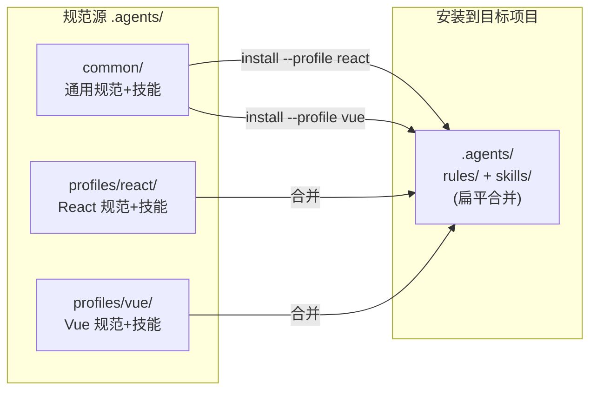
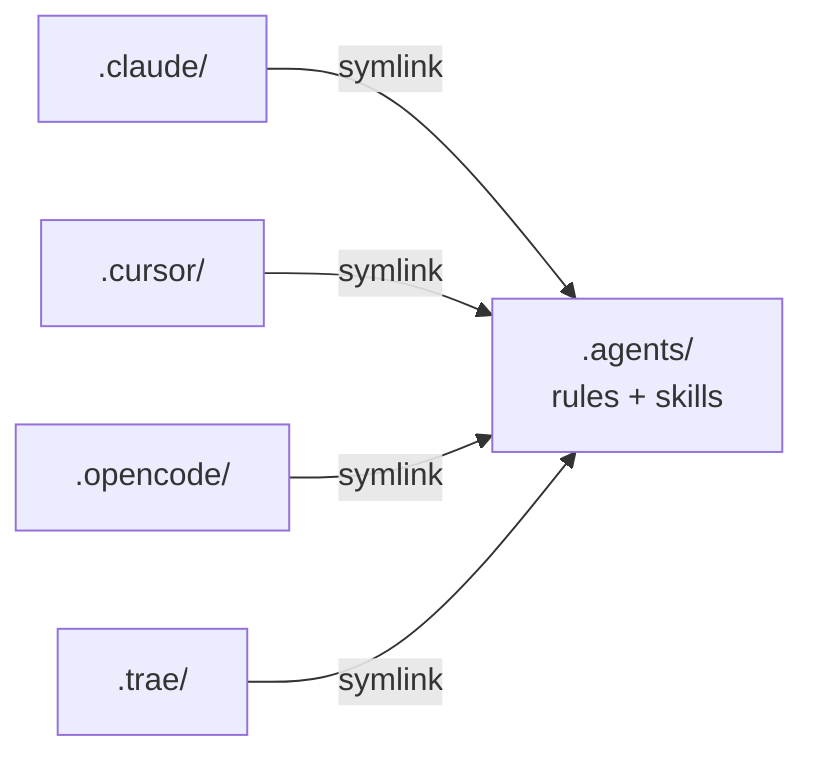

# ex-ai-spec 

AI Coding 团队规范驱动开发 CLI — 让 AI 编码助手遵循统一的开发规范、工作流程和最佳实践。

**适用范围（当前版本）**：面向 **前端** 工程，内置 **Vue 3** 与 **React** 两套 Profile（**TypeScript 优先**，存量 **JavaScript** 项目见 `.agents/rules/common/02-编码规范.md`；Vite、路由、状态管理与样式约定等）。不包含后端或服务端框架的专用规范模板。

支持的 AI IDE：**Cursor** | **Claude Code** | **OpenCode** | **Trae** | 以及 OpenSpec 支持的 25+ 种工具

## 一体化能力与关键路径

完整能力由 **同一项目内多类目录与配置协同** 构成，而不是仅靠 `.agents` 或仅靠 OpenSpec 单独生效：

| 路径 / 配置 | 职责 | 说明 |
|-------------|------|------|
| `.agents/rules/` | 约束层（Rules） | 编码、API、结构、样式等声明式规范 |
| `.agents/skills/` | 操作层（Skills） | 带步骤与清单的过程式技能（含 `create-proposal`、`execute-task` 等） |
| `.cursor/`、`.claude/` 等（L2+） | IDE 适配 | 通过链接引用 `.agents`，保证多 IDE 读同一套源 |
| `.cursor/mcp.json`（L2+） | 上下文层 | 接入 ApiFox、Figma、Playwright 等，补全接口与设计稿上下文 |
| `openspec/`（**L3**） | 流程层（OpenSpec） | `config.yaml` 桥接 ex-ai-spec；`changes/`、`specs/` 管理提案 → 实施 → 归档 |
| 根目录 lint 等（可选） | 自动化层 | 通过 `configs/` 下发的 ESLint / Prettier / Stylelint；husky 按需安装 |

**L1 / L2 / L3 是渐进安装层级**：**默认主推 L3**（含 OpenSpec 完整闭环）。若仅需规范与 MCP、暂不要需求流程，可选用 **L2**；个人试用可用 **L1**。详见下文「安装层级」与 [docs/openspec-guide.md](docs/openspec-guide.md)。

## 快速开始

### npx 一键安装（推荐）

在项目根目录直接运行，无需克隆规范库：

```bash
# 交互式安装（引导选择技术栈和层级）
npx @ex/ai-spec init

# 指定 Profile（未写 --level 时默认为 L3，含 OpenSpec）
npx @ex/ai-spec init --profile vue

# 不要 OpenSpec 时显式指定 L2
npx @ex/ai-spec init --profile vue --level L2
```

> 首次使用前需配置私有源（仅一次）：在 `~/.npmrc` 中添加 `@ex:registry=http://nodejs.100credit.cn/`

更新规范 / 检查状态 / 卸载：

```bash
npx @ex/ai-spec update          # 更新通用规范
npx @ex/ai-spec check           # 检查安装状态
npx @ex/ai-spec uninstall       # 卸载规范库
```

也可以全局安装后直接使用命令：

```bash
npm install -g @ex/ai-spec
ai-spec init --profile react
```

> 跨平台支持：macOS/Linux 自动使用 Bash 脚本，Windows 自动使用 PowerShell 脚本，无需额外配置。

### Monorepo / pnpm workspace

在含 **`pnpm-workspace.yaml`** 或根目录 **`package.json` 含 `workspaces`** 的仓库中：**在希望落规范与依赖的目录执行 `init`**（多数场景为工作区根；若为单应用包，请先 `cd` 到该子包后再执行）。

安装脚本会在检测到 **pnpm 工作区根** 且需向根 `package.json` 写入 **devDependencies** 时自动使用 `pnpm add -w -D`（避免出现 `ERR_PNPM_ADDING_TO_ROOT`）。命令行说明见 `.agents/rules/common/08-通用约束.md` 与 [docs/quick-start.md](docs/quick-start.md)。

### 手动安装（Git 克隆）

```bash
# 克隆规范库
git clone http://git.100credit.cn/zhenwei.li/ex-ai-spec.git
cd ex-ai-spec

# 交互式安装（引导选择技术栈和层级）
bash install.sh init /path/to/your-project

# 指定参数（默认 L3；不要 OpenSpec 时加 --level L2）
bash install.sh init /path/to/your-project --profile vue
```

**Windows PowerShell：**

```powershell
# 首次使用需放开脚本执行策略（仅需执行一次）
Set-ExecutionPolicy -Scope CurrentUser -ExecutionPolicy RemoteSigned

git clone http://git.100credit.cn/zhenwei.li/ex-ai-spec.git
cd ex-ai-spec

# 交互式安装（引导选择技术栈和层级）
.\install.ps1 init C:\path\to\your-project

# 指定参数（默认 L3；不要 OpenSpec 时加 --level L2）
.\install.ps1 init C:\path\to\your-project --profile vue
```

> PS1 脚本与 Bash 脚本功能完全一致，支持交互选择、所有参数和全部安装层级。
> 如果不想修改全局策略，可使用单次绕过：`powershell -ExecutionPolicy Bypass -File .\install.ps1 init .`

**远程安装（无需手动克隆）：**

```bash
# Bash
curl -sSL <raw-url>/install.sh | bash -s -- init . --profile vue

# PowerShell
irm <raw-url>/install.ps1 | iex
```

安装完成后，在 AI IDE 中输入 **"初始化项目规范"** 即可自动分析项目并生成技术栈描述和目录结构规范。

### 技术栈 Profile

| Profile | 技术栈 | 规则数 | 技能数 |
|---------|--------|--------|--------|
| **react** | React + TypeScript（优先；纯 JS 见 02-编码规范）+ Vite + Zustand + Ant Design + SCSS Modules | 13 | 7 |
| **vue** | Vue 3 + TypeScript（优先；纯 JS 见 02-编码规范）+ Vite + Pinia + Vue Router + CSS Modules | 13 | 6 |

### 安装层级

| 层级 | 内容 | 适合场景 |
|------|------|----------|
| **L1** | 只安装 `.agents`（规范 + 技能） | 个人试用、快速体验 |
| **L2** | `.agents` + IDE 适配层 + MCP 模板 | 团队编码规范 + 外部上下文（**不含** OpenSpec，需显式 `--level L2`） |
| **L3** | L2 + OpenSpec（`openspec/`、OPSX 命令与产物） | **默认安装层级、团队主推**：需求提案 → 实施 → 归档闭环，与 `.agents` 通过 `config.yaml` 一体联动 |

### 脚本命令一览

| 命令 | 说明 |
|------|------|
| `install.sh init [dir]` | 首次接入：选择 Profile → 复制规范 → 创建链接 → 检查工具 |
| `install.sh update [dir]` | 更新通用规范（不覆盖项目特有规则 01/03，不覆盖 lint/husky 配置） |
| `install.sh check [dir]` | 检查安装状态、链接有效性、工具环境 |
| `install.sh uninstall [dir]` | 卸载规范库（含清理 lint 配置、husky 和相关依赖） |

`init` / `update` 结束时，终端**最下方**可能再次出现红色「待处理事项」或黄色「配置提醒」：前者表示某步安装/命令失败需按提示补做；仅配置类为后者。若存在未解决的安装失败，脚本会以**非零退出码**结束，便于 CI 感知。

### 可选参数

| 参数 | 说明 | 默认值 |
|------|------|--------|
| `--profile <name>` | 技术栈选择 (`react` / `vue`) | `vue` |
| `--level <L>` | 安装层级 (`L1` / `L2` / `L3`) | `L3` |
| `--ide <name>` | 指定 IDE (`default` / `cursor` / `claude` / `opencode` / `trae` / `all`) | `default`（cursor+claude） |
| `--uipro` | 安装 UI UX Pro Max 设计智能技能 | 交互询问；**非交互必须显式传入** |
| `--no-uipro` | 跳过 UI UX Pro Max | 非交互默认等效于未传 `--uipro`（不安装） |
| `--lint` / `--no-lint` | 是否部署 ESLint/Prettier/Stylelint 并安装依赖 | 交互询问；非交互默认安装 |
| `--husky` / `--no-husky` | 是否部署提交校验（`.husky`、`lint-staged`、`commitlint`）并安装依赖 | 交互默认 N；非交互默认跳过 |
| `--repo <url>` | 自定义规范库地址 | 内置默认地址 |
| `--refresh-cache` | 清除本地缓存并重新克隆规范库 | - |
| `-y, --force` | 跳过确认提示（用于非交互卸载） | - |

---

**说明**：若使用 `npm` / `npx` 时出现 `Unknown project config "strict-peer-dependencies"`、`shamefully-hoist` 等警告，多为项目根目录 `.npmrc` 中写了 **pnpm 专用** 配置；可改用 `pnpm dlx @ex/ai-spec init`，或从仅在 npm 使用的场景下移除/拆分这些键。

### UI UX Pro Max（可选设计技能）

该技能依赖全局包 **`uipro-cli`**（命令 **`uipro`**），在临时目录执行 `uipro init --ai cursor` 后，将资源落到 `.agents/skills/ui-ux-pro-max/`。

- **非交互**（CI、`npx` 无 TTY、脚本管道等）下 **`init` 不会自动安装**（与 lint 不同：lint 非交互默认安装，UI UX Pro Max 必须显式开启）。需要时请加上 **`--uipro`**：
  - `npx @ex/ai-spec init . --uipro`
  - 已有规范后补装或重装：`npx @ex/ai-spec update . --uipro`
- **Windows**：若全局安装后仍提示找不到 `uipro`，请检查 **npm 全局 bin 目录是否已加入 PATH**，或新开终端再试；安装失败时脚本会尽量输出日志路径与尾部内容便于排查。
- **`check`**：仅当存在 `skills/ui-ux-pro-max/SKILL.md` 时显示「已安装」；未安装与安装不完整（仅有目录、缺 `SKILL.md`）会分别提示，不完整时可执行 `update . --uipro` 修复。

---

## 架构概览

### 核心设计：单源多链接 + Profile 分层

`.agents/` 是唯一的规范维护源，按 **common + profiles** 分层组织：



各 IDE 通过软链接（macOS/Linux）或 Junction（Windows）引用同一份内容：



### 源仓库目录结构

```
ex-ai-spec /
├── .agents/                          # 规范维护源
│   ├── rules/
│   │   ├── common/                   # 技术栈无关的通用规范（7 个）
│   │   │   ├── 02-编码规范.md
│   │   │   ├── 05-API规范.md
│   │   │   ├── 08-通用约束.md
│   │   │   ├── 10-文档规范.md
│   │   │   ├── 11-测试规范.md
│   │   │   ├── 12-Superpowers执行规范.md
│   │   │   └── 13-代码格式化与检查.md
│   │   └── profiles/
│   │       ├── react/                # React 技术栈规范（6 个）
│   │       │   ├── 01-项目概述.md ★
│   │       │   ├── 03-项目结构.md ★
│   │       │   ├── 04-组件规范.md
│   │       │   ├── 06-路由规范.md
│   │       │   ├── 07-状态管理.md
│   │       │   └── 09-样式规范.md
│   │       └── vue/                  # Vue 技术栈规范（同上结构）
│   │
│   └── skills/
│       ├── common/                   # 通用技能（10 个）
│       │   ├── create-proposal/      # 提案前置分析（OpenSpec 增强层）
│       │   ├── create-test/          # 创建测试用例
│       │   ├── design-analysis/      # 设计稿分析
│       │   ├── execute-task/         # Superpowers 模式执行任务
│       │   ├── find-skills/          # 搜索与安装技能
│       │   ├── project-init/         # 初始化项目规范
│       │   ├── skill-creator/        # 创建新技能
│       │   ├── ui-verification/      # UI 还原验收
│       │   ├── using-superpowers/    # 技能调度核心
│       │   └── web-design-guidelines/ # Web 设计规范审查
│       └── profiles/
│           ├── react/                # React 技能（7 个）
│           │   ├── create-api/
│           │   ├── create-component/
│           │   ├── create-route/
│           │   ├── create-store/
│           │   ├── theme-variables/
│           │   ├── vercel-composition-patterns/
│           │   └── vercel-react-best-practices/
│           └── vue/                  # Vue 技能（6 个）
│               ├── create-api/
│               ├── create-component/
│               ├── create-store/
│               ├── create-view/
│               ├── theme-variables/
│               └── vue-best-practices/
│
├── configs/                          # lint/format 配置模板
│   ├── common/                       # 所有 Profile 共享
│   │   ├── .editorconfig
│   │   ├── .prettierrc.json
│   │   ├── .prettierignore
│   │   ├── .stylelintrc.json
│   │   ├── .stylelintignore
│   │   ├── .lintstagedrc             # 仅在选择安装提交校验时下发到目标项目
│   │   ├── .husky/                   # 同上（与 --husky / 交互选 Y 一致）
│   │   └── commitlint.config.js      # 同上
│   └── profiles/
│       ├── react/                    # React 特有配置
│       │   ├── .eslintrc.js
│       │   ├── .eslintignore
│       │   └── .stylelintrc.json
│       └── vue/                      # Vue 特有配置
│           ├── .eslintrc.cjs
│           └── .eslintignore
│
├── .cursor/
│   └── mcp.json                     # MCP 服务器配置模板
│
├── openspec/
│   ├── config.yaml.template         # OpenSpec 增强版配置模板
│   ├── specs/                        # （L3 安装后由 OpenSpec 管理）
│   └── changes/                      # （L3 安装后由 OpenSpec 管理）
│
├── docs/
│   ├── quick-start.md               # 5 分钟快速上手
│   ├── install-guide.md             # 详细安装指南
│   └── training-outline.md          # 2 小时团队培训大纲
│
├── install.sh                        # Bash 安装脚本（macOS/Linux/Git Bash/WSL）
└── install.ps1                       # PowerShell 安装脚本（Windows）
```

★ 标记的文件为项目特有规则模板，安装后需根据项目实际情况修改，update 不会覆盖。

---

## 规范体系：Rules + Skills

### 两层设计

- **Rules**：声明式规范，告诉 AI「什么能做、什么不能做」。按需加载，不会自动注入每次对话。
- **Skills**：过程式指令，告诉 AI「具体怎么做」。包含步骤、示例代码和检查清单。

### 通用规范（所有 Profile 共享）

| 规范 | 说明 |
|------|------|
| 02-编码规范 | TypeScript、命名、函数命名 |
| 05-API规范 | 接口命名、错误处理 |
| 08-通用约束 | 中文注释、占位元素 |
| 10-文档规范 | 注释与 JSDoc |
| 11-测试规范 | 测试覆盖与质量门禁 |
| 12-Superpowers执行规范 | 头脑风暴 → TDD → 双重审查 |
| 13-代码格式化与检查 | ESLint、Prettier、Stylelint、husky |

### 通用技能（所有 Profile 共享）

| 技能 | 说明 |
|------|------|
| using-superpowers | 技能调度核心，每次对话启动前检查适用技能 |
| execute-task | Superpowers 模式（头脑风暴 → TDD → 双重审查）执行开发任务 |
| create-proposal | 提案前置分析与 OpenSpec 增强层（需求分析后委托 `/opsx:propose`） |
| design-analysis | 分析设计稿并梳理前端 UI 开发任务 |
| ui-verification | 以实际页面 vs 设计稿比对完成 UI 验收 |
| create-test | 按规范创建 Vitest 测试文件（命名、断言、Mock、覆盖率） |
| project-init | 自动分析项目并生成 01-项目概述 和 03-项目结构 |
| find-skills | 搜索和安装社区技能 |
| skill-creator | 创建新的自定义技能 |
| web-design-guidelines | 审查 UI 代码的 Web 设计规范合规性 |

### Profile 特定技能

| 技能 | React | Vue | 说明 |
|------|:-----:|:---:|------|
| create-component | ✓ | ✓ | 按团队规范创建和拆分组件 |
| create-route / create-view | ✓ | ✓ | 创建路由页面（React: route, Vue: view） |
| create-store | ✓ | ✓ | 创建全局状态（React: Zustand/Redux, Vue: Pinia） |
| create-api | ✓ | ✓ | 按规范创建 HTTP 接口封装 |
| theme-variables | ✓ | ✓ | 正确使用主题 CSS 变量 |
| vercel-react-best-practices | ✓ | - | React/Next.js 性能优化指南 |
| vercel-composition-patterns | ✓ | - | React 组合模式（复合组件等） |
| vue-best-practices | - | ✓ | Vue 3 Composition API 最佳实践与工作流 |

### Profile 特定规范

安装时根据 `--profile` 参数选择对应的技术栈规范和技能，合并到目标项目的 `.agents/` 扁平目录。

---

## OpenSpec 集成（L3）

ex-ai-spec 与 OpenSpec 通过 `openspec/config.yaml` 一个文件桥接：**编码规范在 `.agents/`，需求流程在 `openspec/`**，同一套安装流程（`npx @ex/ai-spec init --level L3` 或 `install.sh` / `install.ps1`）即可落地，无需把 OpenSpec 当作与规范库无关的「外挂」。

- **ex-ai-spec** 管理编码规范和业务技能（`.agents/`）
- **OpenSpec** 管理需求流程（propose → apply → archive）
- `config.yaml` 的 `context` 和 `rules` 字段让 OpenSpec 流程自动引用 ex-ai-spec 规范

L3 安装时，`install.sh` 会在需要时**尝试全局安装** `@fission-ai/openspec` 并运行 `openspec init`（失败时见文末红色待处理事项）；`npx @ex/ai-spec init` 行为以 npm 包实现为准。

```bash
# 完整安装含 OpenSpec
bash install.sh init /path/to/project --profile react --level L3

# 或使用 npx
npx @ex/ai-spec init --profile react --level L3
```

**L3 最简流程**（详版见 [docs/openspec-guide.md](docs/openspec-guide.md)）：

| 阶段 | 做法 |
|------|------|
| **创建提案** | **Cursor**：`/opsx-propose [名称或描述]`；**Claude Code** 等：`/opsx:propose …`。或说「帮我创建一个变更提案」→ `create-proposal` 前置分析后再生成提案。 |
| **实施** | **Cursor**：`/opsx-apply`；**Claude Code** 等：`/opsx:apply`。按 **execute-task** 四步执行 `openspec/changes/<name>/tasks.md`，勿跳过流程直写代码。也可说「开始执行任务」「应用变更」。 |
| **归档** | **Cursor**：`/opsx-archive`；**Claude Code** 等：`/opsx:archive`。 |

详细的 L3 使用指南见 [docs/openspec-guide.md](docs/openspec-guide.md)。

---

## 团队接入指南

详见 [docs/quick-start.md](docs/quick-start.md)、[docs/install-guide.md](docs/install-guide.md) 和 [docs/training-outline.md](docs/training-outline.md)。

### 注意事项

| 事项 | 说明 |
|------|------|
| **项目特有规则** | `01-项目概述.md` 和 `03-项目结构.md` 必须根据项目实际情况填写，update 不会覆盖 |
| **lint/format 配置** | update 时不会覆盖已有的 lint、prettier、husky 等配置文件 |
| **提交校验** | 选 N 或 `--no-husky` 时不会下发 `.husky/`、`.lintstagedrc`、`commitlint.config.js`；已存在 `.husky` 的项目在 `update` 时仍会同步更新 hook 模板 |
| **MCP 配置** | 模板中 MCP 在 Cursor 里常默认**关闭**；先在「设置 → MCP」按需启用，再将 `.cursor/mcp.json` 中 `project-id`、`access-token` 等占位符换成真实值 |
| **OpenSpec** | 仅 **L3** 安装 `openspec/`；L1/L2 可先专注编码规范与 MCP，需要需求闭环时再执行 `init --level L3` 升级（与 [docs/openspec-guide.md](docs/openspec-guide.md) 一致） |
| **Windows 链接** | 使用 Junction（`mklink /J`）替代 symlink，无需管理员权限 |
| **规范更新** | 定期运行 `npx @ex/ai-spec update`，或 `install.sh update` / `.\install.ps1 update` 同步最新通用规范 |
| **缓存管理** | 规范库会缓存到 `~/.ex-ai-spec /`，切换分支或强制刷新时使用 `--refresh-cache` |
| **Monorepo** | 在目标目录执行 `init` 即可（多为工作区根）；pnpm 根目录依赖由脚本自动加 `-w`；详见上文「Monorepo / pnpm workspace」与 [docs/quick-start.md](docs/quick-start.md) |

---

## MCP 配置说明

安装后 Cursor 内各 MCP 可能处于**未启用/关闭**状态，属预期行为。需要接入某项服务时：**先在 Cursor「设置 → MCP」中启用**，再编辑 `.cursor/mcp.json` 填写凭证；不需要的条目可保持关闭。

`.cursor/mcp.json` 中预配置了以下 MCP 服务：

| 服务 | 用途 | 配置要求 |
|------|------|----------|
| ApiFox | 接口文档 | 需替换 `project-id` 和 `access-token` |
| Figma | 设计稿 | 使用 Figma MCP 官方服务 |
| Context7 | 文档检索 | 无需额外配置 |
| Playwright | 页面自动化 | 无需额外配置 |
| Pencil | VS Code 插件 | 需安装 Pencil 插件，路径按实际替换 |

---

## FAQ

**Q: 安装后 AI 没有遵循规范？**
A: 运行 `npx @ex/ai-spec check`，或 `install.sh check` / `.\install.ps1 check` 确认链接有效。部分 IDE 需要重启才能识别新的规则文件。

**Q: Windows 上运行 `install.ps1` 提示"禁止运行脚本"怎么办？**
A: Windows PowerShell 默认禁止执行脚本。运行 `Set-ExecutionPolicy -Scope CurrentUser -ExecutionPolicy RemoteSigned` 放开策略（仅需一次），或使用 `powershell -ExecutionPolicy Bypass -File .\install.ps1 init .` 单次绕过。

**Q: Windows 上 `npx @ex/ai-spec` 报 ParserError / 乱码怎么办？**
A: npm 包内的 `install.ps1` 为 **带 UTF-8 BOM** 的脚本，供 Windows PowerShell 5.1 按 UTF-8 解析中文。若你从网页或聊天里**复制粘贴**了脚本内容另存，可能丢失 BOM，5.1 会按系统代码页误读并出现解析错误；请始终使用包内文件或通过 `npx` 运行。仓库根目录 [`.editorconfig`](.editorconfig) 对 `install.ps1` 指定了 `utf-8-bom`，避免编辑器去掉 BOM。

**Q: PowerShell 脚本和 Bash 脚本功能一样吗？**
A: 是的。`install.ps1` v2.0 已与 `install.sh` 完全功能对齐，支持交互选择、所有参数和全部安装层级。Windows 团队成员也可以使用 Git Bash 运行 `install.sh`。

**Q: 如何在 React 和 Vue 之间切换？**
A: 运行 `install.sh init --profile vue`（或 `.\install.ps1 init --profile vue`）重新安装。会覆盖技术栈相关的规则文件（04/06/07/09），但已修改过的项目特有规则（01/03）会跳过。

**Q: update 会覆盖我修改过的文件吗？**
A: 不会覆盖 `01-项目概述.md` 和 `03-项目结构.md`（项目特有规则），也不会覆盖已有的 lint/format/husky 配置文件。通用规范和技能会全量更新。

**Q: 如何添加自定义规范？**
A: 在安装后的 `.agents/rules/` 下新增文件即可，建议使用数字前缀保持排序（如 `14-自定义规范.md`）。添加新技能则在 `.agents/skills/` 下创建目录和 `SKILL.md`。

**Q: 支持 Monorepo 吗？**
A: 支持。在需要安装规范与依赖的目录执行 `init`（**工作区根或子包目录** 均可）；脚本在 pnpm 工作区根安装 devDependencies 时会自动使用 `pnpm add -w`。若手动向根 `package.json` 加包仍报错 **`ERR_PNPM_ADDING_TO_ROOT`**，请使用 `pnpm add -w <包名>`（见「Monorepo / pnpm workspace」与 [docs/quick-start.md](docs/quick-start.md)）。

**Q: OpenSpec 是必须的吗？**
A: **安装层级上可选**：L1/L2 不包含 `openspec/` 目录与 OPSX 工作流。若团队要做 **规范驱动的前端交付闭环**（提案、任务拆分、实施、归档），建议采用 **L3**：OpenSpec 与 ex-ai-spec 在同一安装流程中落地，通过 `config.yaml` 与 `.agents` 联动；日常小改、bug fix 仍可直接对话开发，不必每条都走提案。

**Q: 我选择了不安装 Husky，为什么以前会出现 `.husky` 目录？**
A: 旧版在同步 lint 配置时会把模板里的 `.husky` 一并复制。当前版本已修复：只有选择安装提交校验（`--husky` 或交互选 Y），或目标项目已有 `.husky`（便于 `update` 维护）时才会下发 `.husky`、`.lintstagedrc` 与 `commitlint.config.js`。
