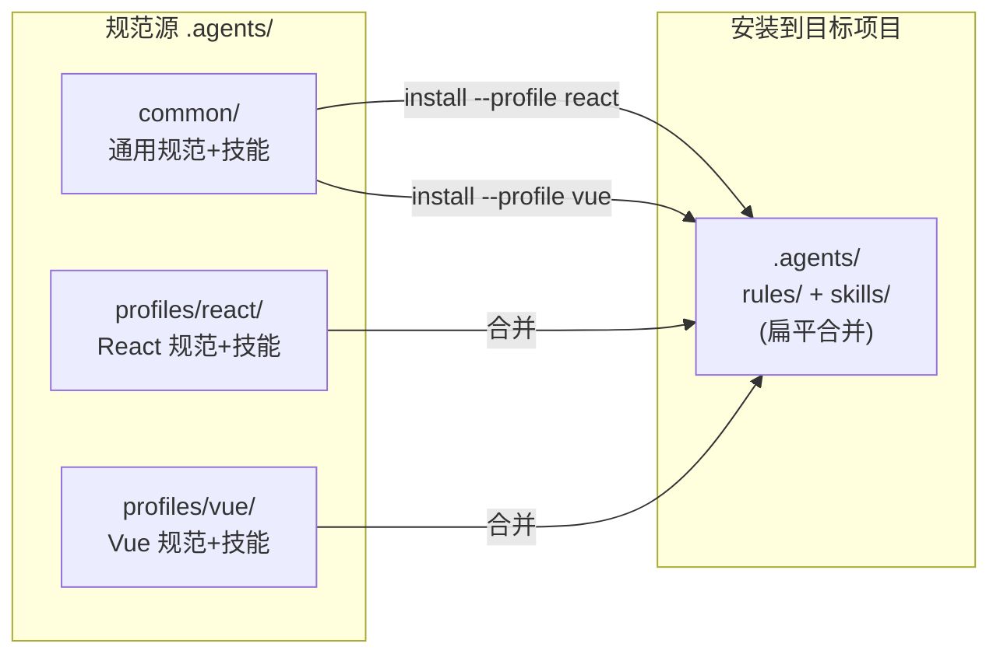
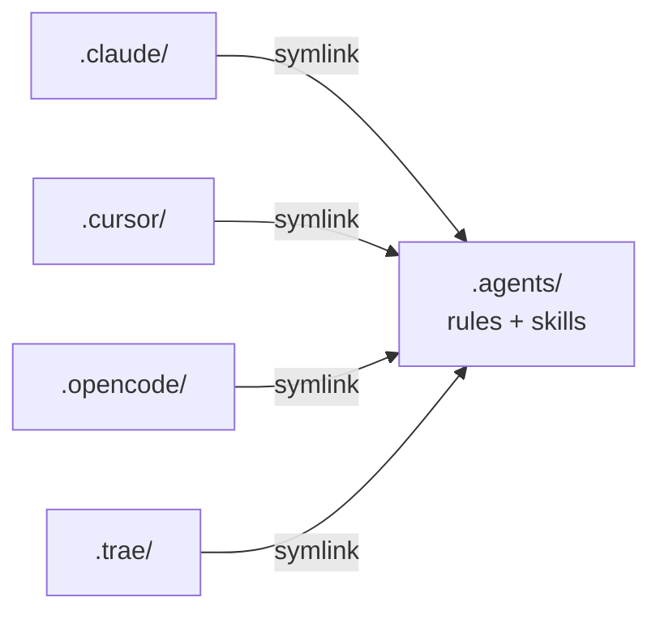

# br-ai-spec

AI Coding 团队规范库 — 让 AI 编码助手遵循统一的开发规范、工作流程和最佳实践。

支持的 AI IDE：**Cursor** | **Claude Code** | **OpenCode** | **Trae** | 以及 OpenSpec 支持的 25+ 种工具

## 快速开始

### 自动安装（推荐）

```bash
# 克隆规范库
git clone http://git.100credit.cn/zhenwei.li/br-ai-standards.git
cd br-ai-spec

# 交互式安装（引导选择技术栈和层级）
bash install.sh init /path/to/your-project

# 指定参数安装
bash install.sh init /path/to/your-project --profile vue --level L2
```

**Windows PowerShell：**

```powershell
git clone http://git.100credit.cn/zhenwei.li/br-ai-standards.git
cd br-ai-spec
.\install.ps1 init C:\path\to\your-project -Profile vue -Level L2
```

安装完成后，在 AI IDE 中输入 **"初始化项目规范"** 即可自动分析项目并生成技术栈描述和目录结构规范。

### 技术栈 Profile

| Profile | 技术栈 | 规则数 | 技能数 |
|---------|--------|--------|--------|
| **react** | React + TS + Vite + Zustand + Ant Design + SCSS Modules | 12 | 7 |
| **vue** | Vue 3 + TS + Vite + Pinia + Vue Router + CSS Modules | 12 | 5 |

### 安装层级

| 层级 | 内容 | 适合场景 |
|------|------|----------|
| **L1** | 只安装 `.agents`（规范 + 技能） | 个人试用、快速体验 |
| **L2** | `.agents` + IDE 适配层 + MCP 模板 | 团队标准接入（默认） |
| **L3** | 全量安装含 OpenSpec 流程 | 需要需求治理与归档 |

### 脚本命令一览

| 命令 | 说明 |
|------|------|
| `install.sh init [dir]` | 首次接入：选择 Profile → 复制规范 → 创建链接 → 检查工具 |
| `install.sh update [dir]` | 更新通用规范（不覆盖项目特有规则 01/03） |
| `install.sh check [dir]` | 检查安装状态、链接有效性、工具环境 |
| `install.sh uninstall [dir]` | 卸载规范库 |

可选参数：`--profile react|vue`、`--level L1|L2|L3`、`--ide cursor`

---

## 架构概览

### 核心设计：单源多链接 + Profile 分层

`.agents/` 是唯一的规范维护源，按 **common + profiles** 分层组织：



各 IDE 通过软链接（macOS/Linux）或 Junction（Windows）引用同一份内容：



### 源仓库目录结构

```
br-ai-spec/
├── .agents/                          # 规范维护源
│   ├── rules/
│   │   ├── common/                   # 技术栈无关的通用规范
│   │   │   ├── 02-编码规范.md
│   │   │   ├── 05-API规范.md
│   │   │   ├── 08-通用约束.md
│   │   │   ├── 10-文档规范.md
│   │   │   ├── 11-测试规范.md
│   │   │   └── 12-Superpowers执行规范.md
│   │   └── profiles/
│   │       ├── react/                # React 技术栈规范
│   │       │   ├── 01-项目概述.md ★
│   │       │   ├── 03-项目结构.md ★
│   │       │   ├── 04-组件规范.md
│   │       │   ├── 06-路由规范.md
│   │       │   ├── 07-状态管理.md
│   │       │   └── 09-样式规范.md
│   │       └── vue/                  # Vue 技术栈规范
│   │           └── (同上结构)
│   └── skills/
│       ├── common/                   # 通用技能
│       │   ├── create-proposal/
│       │   ├── design-analysis/
│       │   ├── ui-verification/
│       │   ├── execute-task/
│       │   ├── project-init/
│       │   └── using-superpowers/
│       └── profiles/
│           ├── react/                # React 技能
│           │   ├── create-component/
│           │   ├── create-route/
│           │   ├── create-store/
│           │   ├── create-api/
│           │   └── theme-variables/
│           └── vue/                  # Vue 技能
│               ├── create-component/
│               ├── create-view/
│               ├── create-store/
│               ├── create-api/
│               └── theme-variables/
│
├── .cursor/
│   └── mcp.json                     # MCP 服务器配置模板
│
├── openspec/
│   ├── config.yaml.template         # OpenSpec 增强版配置模板
│   ├── specs/                        # （L3 安装后由 OpenSpec 管理）
│   └── changes/                      # （L3 安装后由 OpenSpec 管理）
│
├── docs/
│   ├── quick-start.md               # 5 分钟快速上手
│   └── training-outline.md          # 2 小时团队培训大纲
│
├── install.sh                        # Bash 安装脚本
└── install.ps1                       # PowerShell 安装脚本
```

★ 标记的文件为项目特有规则模板，安装后需根据项目实际情况修改，update 不会覆盖。

---

## 规范体系：Rules + Skills

### 两层设计

- **Rules**：声明式规范，告诉 AI「什么能做、什么不能做」。按需加载，不会自动注入每次对话。
- **Skills**：过程式指令，告诉 AI「具体怎么做」。包含步骤、示例代码和检查清单。

### 通用规范（所有 Profile 共享）

| 规范 | 说明 |
|------|------|
| 02-编码规范 | TypeScript、命名、函数命名 |
| 05-API规范 | 接口命名、错误处理 |
| 08-通用约束 | 中文注释、占位元素 |
| 10-文档规范 | 注释与 JSDoc |
| 11-测试规范 | 测试覆盖与质量门禁 |
| 12-Superpowers执行规范 | 头脑风暴 → TDD → 双重审查 |

### Profile 特定规范

安装时根据 `--profile` 参数选择对应的技术栈规范和技能。

---

## OpenSpec 集成（L3）

br-ai-spec 与 OpenSpec 通过 `openspec/config.yaml` 一个文件桥接，职责完全分离：

- **br-ai-spec** 管理编码规范和业务技能（`.agents/`）
- **OpenSpec** 管理需求流程（propose → apply → archive）
- `config.yaml` 的 `context` 和 `rules` 字段让 OpenSpec 流程自动引用 br-ai-spec 规范

L3 安装时，`install.sh` 会自动运行 `openspec init`，生成 OpenSpec 的 skill 和 command 文件。

```bash
# 完整安装含 OpenSpec
bash install.sh init /path/to/project --profile react --level L3
```

---

## 团队接入指南

详见 [docs/quick-start.md](docs/quick-start.md) 和 [docs/training-outline.md](docs/training-outline.md)。

### 注意事项

| 事项 | 说明 |
|------|------|
| **项目特有规则** | `01-项目概述.md` 和 `03-项目结构.md` 必须根据项目实际情况填写，update 不会覆盖 |
| **MCP 配置** | `.cursor/mcp.json` 中的 token 和 project-id 是占位符，需替换为实际值 |
| **OpenSpec** | 仅 L3 级别安装，其他级别可忽略 |
| **Windows 链接** | 使用 Junction（`mklink /J`）替代 symlink，无需管理员权限 |
| **规范更新** | 定期运行 `install.sh update` 同步最新通用规范，项目特有规则不受影响 |

---

## MCP 配置说明

`.cursor/mcp.json` 中预配置了以下 MCP 服务：

| 服务 | 用途 | 配置要求 |
|------|------|----------|
| ApiFox | 接口文档 | 需替换 `project-id` 和 `access-token` |
| Figma | 设计稿 | 使用 Figma MCP 官方服务 |
| Context7 | 文档检索 | 无需额外配置 |
| Playwright | 页面自动化 | 无需额外配置 |
| Pencil | VS Code 插件 | 需安装 Pencil 插件，路径按实际替换 |

---

## FAQ

**Q: 安装后 AI 没有遵循规范？**
A: 运行 `install.sh check` 确认链接有效。部分 IDE 需要重启才能识别新的规则文件。

**Q: 如何在 React 和 Vue 之间切换？**
A: 运行 `install.sh init --profile vue` 重新安装。注意：会覆盖技术栈相关的规则文件（01/03/04/06/07/09），但不会影响项目特有规则（如果已修改过 01/03 则跳过）。

**Q: update 会覆盖我修改过的文件吗？**
A: 不会覆盖 `01-项目概述.md` 和 `03-项目结构.md`（项目特有规则）。其他通用规范和技能会全量更新。

**Q: 如何添加自定义规范？**
A: 在安装后的 `.agents/rules/` 下新增文件即可，建议使用数字前缀保持排序（如 `13-自定义规范.md`）。添加新技能则在 `.agents/skills/` 下创建目录和 `SKILL.md`。

**Q: 支持 Monorepo 吗？**
A: 支持。在 Monorepo 根目录运行安装脚本，所有子项目共享同一套规范。如果子项目需要独立规范，可分别安装。

**Q: OpenSpec 是必须的吗？**
A: 不是。L1/L2 级别不包含 OpenSpec。OpenSpec 更适合新功能开发、跨模块变更等需要需求治理的场景。
