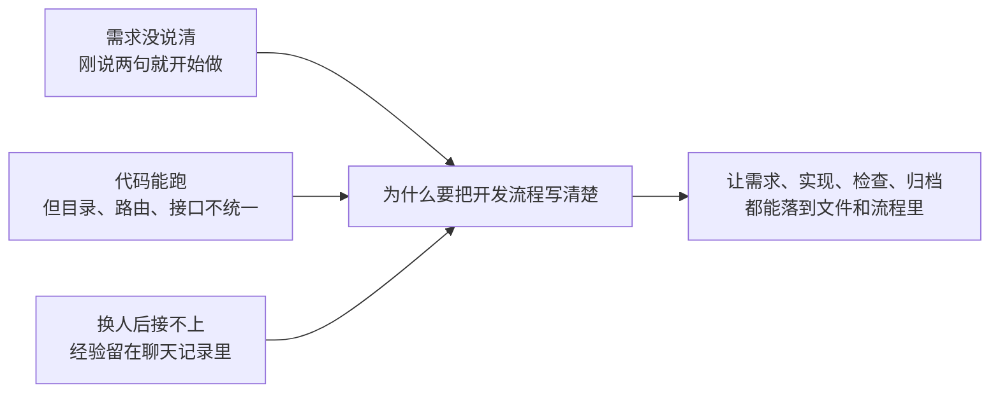
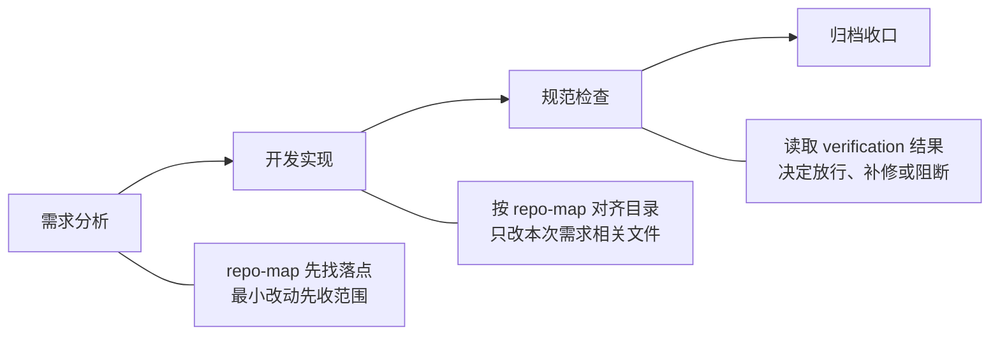
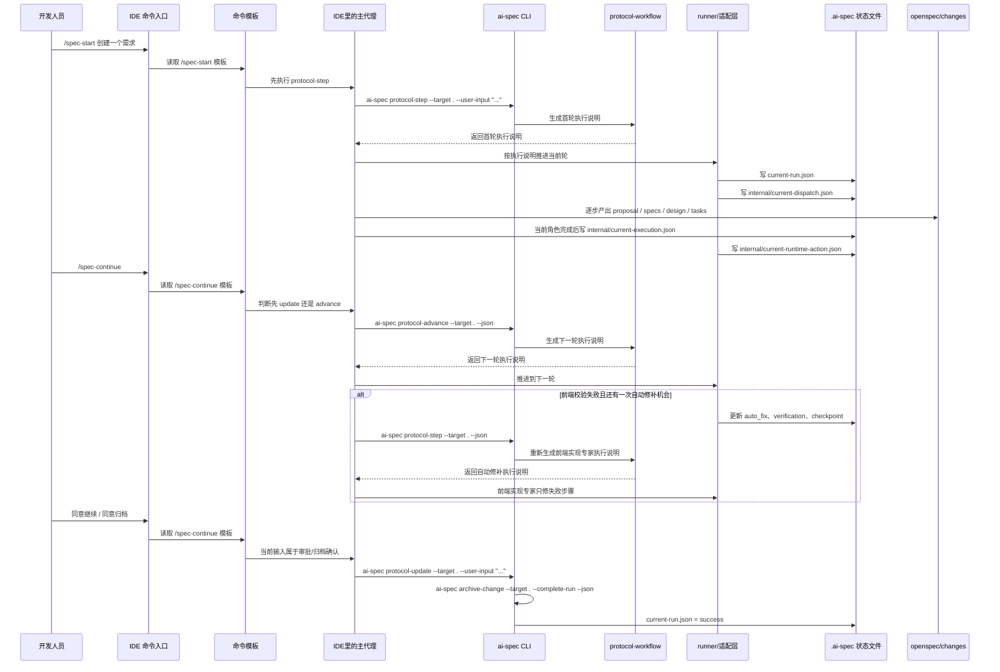
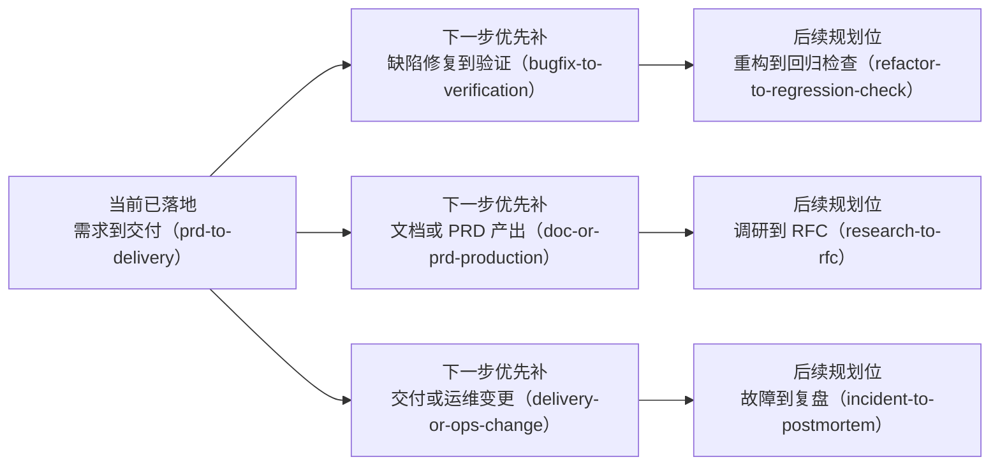

# 开发人员规范化开发实践：为什么值得学，怎么开始用

> 适用对象：第一次接触这套流程的开发人员、试点项目参与人、可能看过其他竞品方案的使用者  
> 建议阅读时长：6 到 8 分钟  
> 这篇文档适合作为第一次接触这套流程时的介绍文

这篇文档只想回答两件事：为什么 AI 开发不能再停留在“谁更会写 prompt”，以及今天怎么开始用规范化的方法做开发。  
AI Coding 下半场，重点不是让 AI 更快写，而是让它按团队方法稳定地做。后面这篇文档会把这件事拆开讲清楚：为什么值得学、第一次接项目先看什么、输入 `/spec-start` 之后项目里到底会发生什么。

## 背景

现在最麻烦的，早就不是“写不写得出来”，而是“写出来之后接不接得住”。需求刚说两句代码就开始改，功能虽然做完了但不符合项目约定，这次能交，下次别人却接不上手。真正拖慢团队的，往往不是不会写，而是每次都要重新对齐、重新返工、重新补洞。



- 常见情况一：需求还没收敛，代码已经动起来了，最后返工还是算在开发上。
- 常见情况二：功能虽然做出来了，但目录、路由、接口、样式不按项目约定走，后面改起来比重写还累。
- 常见情况三：一次会话里做得不错，换个人或者换个时间点就接不上，因为真正能复用的东西没有落到项目里。

说到底，问题不在“会不会用 AI”，而在“这套做法能不能稳定复用，不靠个人记忆”。

## 竞品分析

如果只比“谁能写代码、谁能改文件”，很容易把这章写浅。对我们来说，更有价值的比较方式是看三件事：抽象层级怎么选、协作靠什么传递、状态靠什么治理。

### 格局定位

| 维度 | `LangGraph`（状态驱动型） | `Aider`（极客工具型） | `br-ai-spec`（规范驱动型） |
| --- | --- | --- | --- |
| 核心哲学 | 用图和状态机控制长任务 | 用代码地图和精确编辑解决单点修改 | 用 OpenSpec、角色分工和运行状态把需求到归档串成稳定流程 |
| 适用场景 | 复杂流程、循环节点、多步长任务 | 个人开发者快速修改、重构、定位代码 | 团队协作、规范落盘、多人接力、长期维护 |
| 协作方式 | 节点和状态边驱动 | 以当前会话和代码编辑为中心 | 以产物文件、角色说明、运行状态为中心 |
| 治理重点 | 状态转换、回环控制、可恢复 | 修改精度、仓库感知、反馈快 | 规范约束、交接一致性、变更可追踪 |

如果把它们放在同一张图里看，`LangGraph` 更像流程控制框架，`Aider` 更像高效率编码工具，而 `br-ai-spec` 更像把规范、流程、产物和角色协作串起来的协议层。

### 关键技术路径

| 对比点 | 常见做法 | `br-ai-spec` 当前做法 |
| --- | --- | --- |
| 上下文治理 | 依赖聊天记录或启发式片段注入，越到后面越容易变重 | 按角色裁剪上下文，只给当前角色必要的规则、产物快照和读写边界 |
| 协作交接 | 经常把整段对话历史往后传，噪声多 | 交接主要靠 `proposal / specs / design / tasks / checklist / iterations` 和 `.ai-spec` 状态文件 |
| 状态治理 | 流程状态混在会话里，容易漂 | 用 `current-run.json`、`checkpoints/`、门禁和恢复能力把状态单独落盘 |
| 确认机制 | 很多时候还是靠口头确认 | 把 `before-implementation`、`before-archive` 做成显式门禁，配合 `protocol-update` 和验证结果推进 |

从这个角度看，我们真正的差异不在“能不能写代码”，而在“怎么把上下文、交接和状态治理成一套能长期复用的开发流程”。

### 借鉴边界

放回当前项目里看，可以把对这两个方向的借鉴记成一句话：

- 对 `LangGraph`，我们借的是状态机、门禁、checkpoint / restore 和有限回环这些思路。
- 对 `Aider`，我们借的是代码地图、验证结果回灌、最小改动和一次自动修补这些思路。

但我们没有照搬它们的完整产品形态。当前阶段更重要的是先把开发人员日常最常见的需求、实现、检查、归档这条链跑稳。

## 方案设计

这一章重点讲三件事：项目里先看哪些目录、第一次怎么开始、输入 `/spec-start` 后到底发生了什么。

### 项目目录与关键文件

先记住这几个位置，开发阶段大多数问题都绕不开它们：

```text
project-root/
├── bin/                         # CLI 命令入口，想看命令从哪进先看这里
│   ├── cli.js                   # 命令总入口
│   ├── protocol-workflow.js     # 协议入口：开第一轮、推进下一轮、记录补充输入和审批结果
│   ├── task-orchestrator-runner.js # 应用本轮结果、写状态、决定是否切到下一角色
│   └── sync.js                  # 按安装清单同步项目
├── internal/                    # 协议和流程实现，想看命令背后的逻辑再看这里
│   └── ai-protocol-workflow.js  # 生成本轮执行说明，决定下一步该调哪个协议命令
├── .agents/                     # 团队约定和常用做法，新接项目先看这里
│   ├── rules/                   # 规则约束
│   ├── skills/                  # 常用做法
│   ├── roles/                   # 角色分工
│   ├── flows/                   # 流程模板
│   └── commands/common/         # IDE 里最常用的命令模板
│       ├── spec-start.md        # 第一次发起需求时会读这个模板
│       └── spec-continue.md     # 继续推进、审批确认、归档确认时会读这个模板
├── openspec/
│   ├── config.yaml             # 这条流程接了哪些规范，边界是什么
│   ├── changes/<change-id>/    # 这次需求沉淀下来的产物
│   │   ├── proposal.md         # 目标、范围、默认假设、风险
│   │   ├── design.md           # 方案落点和关键约束
│   │   ├── tasks.md            # 可执行任务清单
│   │   ├── checklist.md        # 交付检查结论
│   │   ├── iterations.md       # 问题、修正动作、残留风险
│   │   └── specs/              # 本次需求对应的增量规范
│   └── specs/                  # 已归档、可长期复用的规范
└── .ai-spec/
    ├── manifest.json           # 当前项目装了哪些规则、技能、角色和流程
    ├── current-run.json        # 这轮任务现在走到哪一步了
    ├── checkpoints/            # 每次关键状态变化都会在这里留快照，便于回看和恢复
    │   └── <run-id>/           # 例如 001-bootstrap.json、002-handoff.json
    ├── repo-map.json           # 当前仓库关键目录映射，帮助流程判断页面、路由、mock、接口落点
    └── internal/
        ├── tmp/
        │   ├── task-orchestrator-reply.md   # 主代理当前回复草稿
        │   ├── task-orchestrator-turn.json  # 本轮执行说明草稿
        │   ├── current-dispatch.json        # 当前轮派发草稿
        │   ├── current-execution.json       # 当前角色执行草稿
        │   └── current-runtime-action.json  # 下一步动作草稿
        ├── current-dispatch.json            # 当前轮该谁接手
        ├── current-execution.json           # 当前角色刚做了什么
        └── current-runtime-action.json      # 下一步交给谁，或卡在什么确认点
```

如果你只想知道“现在卡在哪”，优先看 `current-run.json`；如果你想知道“这次需求都落了什么文件”，优先看 `openspec/changes/<change-id>/`；如果你想知道“命令到底从哪进、背后怎么跑”，再看 `bin/` 和 `internal/`；如果你想回看这轮什么时候被阻塞、什么时候交接过，直接看 `.ai-spec/checkpoints/`。

### 人工快速使用

如果是第一次接，最稳的办法不是一下子铺开，而是先拿一个低风险场景跑通，比如 mock 页、列表页改版、设计稿还原。

```bash
# 在试点项目完成接入（Vue 项目）
npx @ex/ai-spec init . --profile vue --level L3

# 如果是 React 项目，把 profile 换成 react
npx @ex/ai-spec init . --profile react --level L3
```

```text
# 在 IDE 里发起一个低风险需求
/spec-start 创建一个商品详情 mock 页面，只做演示版，数据本地 mock

# 按流程继续推进
/spec-continue

# 遇到归档确认时输入
同意归档
```

任务做完后，不要只看“这次完成了没有”，还要把踩坑点补回规则和文档里，让下次同类任务更顺。

这条最小链，现在可以先理解成四步：需求分析、开发实现、规范检查、归档收口。

如果把流程里几个容易忽略、但很实用的点单独拎出来，可以先记成下面这张图：



- `repo-map` 负责先把页面、路由、mock、接口这些落点找出来，减少“这个文件到底该放哪”的来回确认。
- `verification` 负责把 `build / lint / test` 的结果接回流程里，后面的规范检查不是凭感觉判断，而是直接看结果。
- `最小改动` 负责把范围收住，避免一边做一边扩，或者修一个问题顺手改一大片。

### 从 `/spec-start` 到归档，命令和文件怎么串起来的

下面这张图说的就是：你在 IDE 里打一条命令后，项目里到底会发生什么。



这条链可以这么理解：

- `/spec-start` 实际上先会读取 `.agents/commands/common/spec-start.md` 这类命令模板，然后由 IDE 里的主代理执行里面规定的第一条命令：`protocol-step`。
- `protocol-workflow.js` 可以先记成一个协议入口。里面最常用的 3 个命令分别负责不同事情：
  - `protocol-step`：开第一轮，或者在需要时重新拿一份最新的执行说明。
  - `protocol-advance`：当前一轮做完后，推进到下一轮。
  - `protocol-update`：记录补充输入、审批意见和归档决定；在 `before-archive` 这类场景下，它还可以直接走快速收口，不必再额外空跑一次推进。
- `protocol-step` 会返回一份“本轮执行说明”，里面会告诉主代理：当前轮是谁来做、允许读哪些文件、允许写哪些文件、下一步该调用什么命令。内部字段名还是 `turn`，但这篇里统一叫“本轮执行说明”。
- 主代理不是被 CLI 主动通知的，而是主代理自己去调用 `protocol-step / protocol-advance / protocol-update`，再根据返回的执行说明继续往下做。
- `protocol-advance` 负责推进到下一轮；如果当前输入本身是审批、放行、归档确认，主代理会优先走 `protocol-update`，而不是先空跑 `protocol-advance`。
- 现在这条链已经不只是“开一轮、推一轮”了。如果前端实现阶段校验失败，系统会把失败步骤写进 `current-run.json`，并在还有次数时回到前端实现专家做一次自动修补；如果修补后还是失败，再交给规范守护者按阻断项处理。
- 需求分析阶段会把 `proposal / specs / design / tasks` 落到 `openspec/changes/<change-id>/`。
- 开发实现阶段会改项目自己的业务代码。
- 检查阶段会补 `checklist.md` 和 `iterations.md`。
- 运行过程中每次关键变化还会写入 `.ai-spec/checkpoints/<run-id>/`，需要回看或恢复时可以直接用这些快照。
- `.ai-spec/repo-map.json` 会把当前项目里的页面目录、路由目录、mock 目录、接口目录等映射出来，流程在给实现专家下发说明时会用到这些落点信息。
- 最后归档会把该沉淀的内容并进 `openspec/specs/`，再把这次变更移动到归档目录。

如果你平时只看到 `/spec-start` 这一个入口，这张图就是它背后真正串起来的命令和文件流。

## 推广统计

推广有没有效果，不用看得太复杂，先看三层就够了。

| 层次 | 先看什么 | 说明什么 |
| --- | --- | --- |
| 接入层 | 有没有项目真正开始用 | 说明这件事不是停留在讨论里 |
| 过程层 | 流程有没有从需求跑到归档 | 说明这套做法不是半路断掉 |
| 结果层 | 返工和规范问题有没有变少 | 说明这套做法开始有实际价值 |

当前已经确认的底盘数据是：`v0.0.41`、`21` 条规则、`25` 个技能、`32` 个角色、`5` 个活跃角色、`1` 条活跃流程。

真正值得关注的，不只是这些数量，而是两个更直接的变化：一是同类任务有没有越来越少靠个人记忆，二是一次任务做完后，别人能不能更容易接着做。

## 后续规划

现在已经有一条最小流程跑起来了，但后面不可能只靠这一条模板覆盖所有事。



可以把后面的方向看成三层：

- 现在：先把 `prd-to-delivery` 这条链跑稳，覆盖需求、开发、检查、归档。
- 下一步：补上问题修复、文档生产、交付改造这几类更常见的协作场景。
- 后面再看：调研、重构回归、故障复盘这些更重的场景。

这也意味着，以后参与协作的角色不会只停在当前这几个：

- 现在主要是：需求分析、开发实现、规范检查、归档收口。
- 后面会慢慢多出：文档整理、验证复查、测试补强、发布交付、故障复盘等分工。

所以这件事不是把系统讲得越来越复杂，而是让开发人员在不同类型的任务里，都知道该从哪条流程开始、该看哪些文件、该怎么继续往下走。
