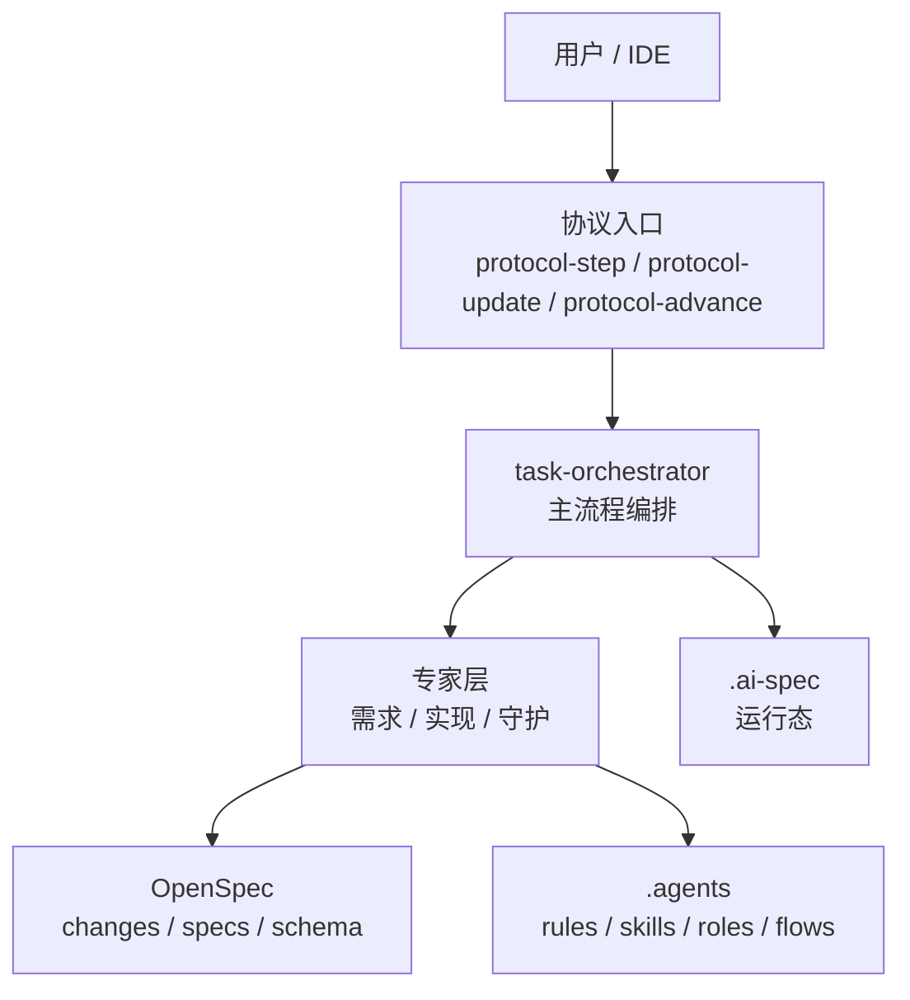

# OpenSpec 最佳实践与项目运行机制说明

> 适用对象：管理者、项目负责人、平台负责人、核心研发  
> 文档定位：`ai-spec-auto` 对外介绍、内部对齐、works 插件“最佳实践文章”基础稿

## 1. 执行摘要

`ai-spec-auto` 不是一个“让 AI 自由写代码”的工具集合，而是一套基于 `OpenSpec` 的规范驱动开发底座。它的目标，是把 AI 交付从“临场发挥”升级为“可约束、可追溯、可复用”的团队协作机制。

当前项目已经完成的核心闭环是：

- 需求先沉淀为规范产物，再进入实现
- 专家按固定职责串联，而不是同一代理包办全部工作
- 运行过程有最小状态记录、checkpoint 与 restore，可恢复、可审计、可归档
- 归档阶段支持本地 fast-path，避免简单归档动作再次消耗一轮大模型推理

如果给管理层只传达一句话，建议统一口径为：

> `OpenSpec` 管变更产物，`.agents` 管专家执行，`task-orchestrator` 管流程推进，`.ai-spec` 管运行状态。

---

## 2. 这件事解决的管理问题

在没有规范驱动底座之前，团队使用 AI 做研发协作，通常会遇到 4 个问题：

1. 输出不可控  
AI 容易直接进入编码，绕过需求澄清、设计取舍和交付校验。

2. 团队规范难复制  
代码风格、目录约定、接口封装、测试要求往往散落在文档和口头约定中，难以稳定注入到每一次 AI 执行。

3. 过程不可追溯  
一次需求为什么这样实现、谁做了什么判断、归档前发生过哪些修正，缺少结构化记录。

4. 扩展成本高  
没有统一底座时，每个 IDE、每个插件、每个团队都要重复解决流程编排和上下文治理问题。

`ai-spec-auto` 的价值就在于把这 4 个问题，收敛到一套标准化的工程机制里，并尽量把关键事实落成项目内文件，而不是只停留在对话里。

---

## 3. 当前阶段的项目定位

### 3.1 当前在做什么

当前阶段，项目聚焦于搭建一条最小但真实可运行的专家协同交付主链：

`requirement-analyst -> frontend-implementer -> code-guardian`

围绕这条主链，项目重点建设 4 类能力：

- `OpenSpec` 产物底座
- 专家规则与技能体系
- 运行态与门禁机制
- 安装与 IDE 适配能力

### 3.2 当前不优先做什么

以下方向是后续融合项，不是当前阶段的重点：

- Hub 资产平台深度对接
- 大而全的页面化平台能力
- 按域安装 / 按流程安装的产品化组合
- OpenClaw 自动化流水线
- 团队级可观测平台

这意味着项目策略非常明确：

> 先把底层闭环跑通，再做平台化放大。

---

## 4. 对管理层最重要的业务价值

从管理视角看，这套机制的价值不是“又多了一套配置文件”，而是让 AI 研发具备工程治理能力。

### 4.1 交付更可控

- 先产出 `proposal / specs / design / tasks`，再进入编码
- 关键节点支持门禁，不再默认“一路写到底”
- 归档前可以明确区分“通过”“暂不归档”“补充说明”

### 4.2 规范更可复制

- 团队规范不再只存在于人的经验里
- 规则、技能、角色、流程都可沉淀为仓库资产
- 新项目接入时可以复用同一套治理骨架

### 4.3 过程更可审计

- 每轮运行都会记录到 `.ai-spec/current-run.json`
- 默认只在 `.ai-spec/current-run.json` 追加 `events`
- 如需恢复/调试级快照，可通过 `AI_SPEC_PERSIST_CHECKPOINTS=1` 额外写入 `.ai-spec/checkpoints/<run-id>/`
- 轻量仓库地图会写到 `.ai-spec/repo-map.json`
- 每次需求的中间产物与归档结果都落在 `openspec/changes/` 与 `openspec/specs/`
- 出现问题时，可以基于事件链而不是聊天记录追责和复盘

### 4.4 扩展更可持续

- 后续接入 works 插件、Hub、IDE 扩展时，不必重写底层协议
- 产品层只需复用同一套 schema、rules、skills、runtime 约束

---

## 5. OpenSpec 官方最佳实践，落到本项目的正确方式

结合 OpenSpec 官方思路和当前项目实践，可以归纳出 6 条适合推广的最佳实践：

1. 先提案、再实现  
先对齐目标、范围、风险和验收，再进入代码变更。

2. 规范与代码同仓管理  
`openspec/specs/` 不是临时草稿区，而是项目长期上下文资产。

3. 采用轻量增量，而不是重流程  
每次只处理一个真实增量，避免一次性设计过度。

4. 用产物对齐意图，而不是只看自然语言  
`proposal.md`、`design.md`、`tasks.md`、`spec delta` 是管理协作的中间控制点。

5. 保持上下文干净  
上下文越清晰，AI 偏航越少。规则应简洁，技能应具体，状态应最小化。

6. 增强层应挂在 OpenSpec 之上，而不是绕开 OpenSpec 再造流程  
`ai-spec-auto` 的正确做法不是替代 OpenSpec，而是把团队执行约束叠加到 OpenSpec 的变更节奏之上。

---

## 6. 这套机制是如何分层工作的

可以把当前项目理解为 5 层协同：



分层职责如下：

| 层 | 核心作用 | 管理者需要知道什么 |
| --- | --- | --- |
| `OpenSpec` | 负责变更产物 | 所有需求和归档都应有可落盘产物 |
| `.agents/rules` | 负责团队硬约束 | 约束 AI 不能越界、不能乱改 |
| `.agents/skills` | 负责执行方法 | 把“如何做”沉淀为可复用动作 |
| `task-orchestrator` | 负责流程推进 | 决定谁先做、谁后做、何时卡门禁 |
| `.ai-spec` | 负责运行状态 | 记录当前做到哪一步、最近 checkpoint、是否成功闭环 |

---

## 7. 为什么要使用自定义 `expert-delivery` schema

OpenSpec 默认 schema 更偏通用规范流程，而当前项目需要承接的是“专家协同交付流程”。因此我们引入了自定义 schema：

```yaml
schema: expert-delivery
```

原因有 3 个：

1. 当前流程不只需要提案和任务，还需要完整交付链产物  
除 `proposal`、`specs`、`design`、`tasks` 外，还要求有 `checklist` 和 `iterations`。

2. `design` 必须成为正式产物  
它不是可有可无的附录，而是连接需求与实现的结构性中间层。

3. `specs` 需要支持多 domain  
不应把规范永久绑定到 `specs/ui/spec.md` 这类单一路径，而应支持 `specs/<domain>/spec.md` 的增量沉淀。

当前推荐的产物骨架是：

- `proposal.md`
- `specs/<domain>/spec.md`
- `design.md`
- `tasks.md`
- `checklist.md`
- `iterations.md`

这套骨架的意义是：把一次 AI 交付拆成可以管理、可以审查、可以归档的 6 个检查点。

同时，当前运行态目录已经固定为：

- `.ai-spec/current-run.json`：当前事实状态
- `.ai-spec/checkpoints/<run-id>/`：仅在 `AI_SPEC_PERSIST_CHECKPOINTS=1` 时写出的关键迁移快照
- `.ai-spec/repo-map.json`：轻量仓库地图

---

## 8. `config.yaml` 的最佳实践：它该做什么，不该做什么

`openspec/config.yaml` 是项目级桥接配置，不是“第二本执行手册”。

建议管理层只抓住 3 个原则：

1. `schema` 决定产物骨架  
2. `context` 决定项目事实与执行优先级  
3. `rules` 决定每类产物必须体现的边界

不建议把长篇流程教学、整套操作说明或完整技能正文写进 `config.yaml`。

### 8.1 推荐结构

```yaml
schema: expert-delivery

context: |
  本项目接入 ai-spec-auto 专家协同平台：
  - rules: .agents/rules/
  - skills: .agents/skills/
  - roles: .agents/roles/
  - flows: .agents/flows/
  - runtime: .ai-spec/

rules:
  proposal:
    - "先收敛目标、范围、非目标项、假设和风险。"
  specs:
    - "需求必须落为可测试的增量规范。"
  design:
    - "技术方案必须对齐项目目录、路由、API、状态与样式约定。"
  tasks:
    - "任务必须可执行、可验证、可交接。"
  checklist:
    - "检查结论必须基于实现证据与产物。"
  iterations:
    - "必须记录问题、修正动作和残留风险。"
```

### 8.2 推荐边界

| 配置项 | 应该放什么 | 不应该放什么 |
| --- | --- | --- |
| `schema` | 产物结构、依赖关系 | 团队行为规范 |
| `context` | 项目事实、目录入口、执行优先级 | 大段操作步骤 |
| `rules` | 各 artifact 的最小边界约束 | 技能正文、长流程脚本 |

一句话总结：

> `config.yaml` 负责“定边界”，`.agents` 负责“给做法”。

---

## 9. `config.yaml`、rules、skills、schema 应该如何配合

这是团队最容易混淆、也是最需要统一口径的部分。

### 9.1 正确分工

| 组件 | 角色定位 | 典型内容 |
| --- | --- | --- |
| `openspec/schemas/*` | 流程骨架定义 | 有哪些产物、谁依赖谁、模板写到哪里 |
| `openspec/config.yaml` | 项目级配置桥接 | 选哪套 schema、项目事实、各阶段最小约束 |
| `.agents/rules/*` | 团队硬约束 | 命名约定、目录边界、禁止项、必须项 |
| `.agents/skills/*` | 执行动作模板 | 如何建路由、如何建接口、如何写测试 |
| `.agents/flows/*` | 交接顺序定义 | 角色主链、门禁、必需输入输出 |
| `.ai-spec/*` | 运行事实记录 | 当前角色、当前状态、checkpoint、审批门禁、轻量仓库地图 |

### 9.2 正确理解方式

- `schema` 回答：“这套流程长什么样”
- `config.yaml` 回答：“这个项目怎么用这套流程”
- `rules` 回答：“哪些事不能乱做”
- `skills` 回答：“具体应该怎么做”
- `runtime` 回答：“现在做到哪里了”

如果这 5 层边界清晰，团队规模扩大后依然可以维持一致性；如果混在一起，后续插件化和平台化都会失控。

---

## 10. 当前主流程如何运行

当前主流程模板为：

`requirement-analyst -> frontend-implementer -> code-guardian`

默认门禁为：

- `before-implementation`
- `before-archive`

流程可简化理解为 6 步：

1. 用户发起需求  
通过 `protocol-step` 进入协议轮次，而不是直接开始编码。

2. 主代理生成当前轮次  
`task-orchestrator` 负责判断任务档位、首位专家、所需产物和门禁。

3. Runner 建立运行态  
写入 `.ai-spec/current-run.json`，标记流程正式启动。

4. 需求专家产出结构化需求  
落盘 `proposal / specs / design / tasks`。

5. 实现专家与守护专家继续推进  
实现代码、补充检查、记录问题与修正。

6. 归档或结束  
守护专家完成后，进入 `before-archive` 门禁，确认归档意图，再合并规范与归档变更。

### 10.1 一个已验证的最佳实践

归档本质上是“确认意图 + 更新运行状态 + 合并归档文件”，不应该再次消耗一轮完整的大模型编排。

因此当前实现采用了 `before-archive` 本地 fast-path：

- 用户明确表达“归档”时，直接本地推进归档
- 用户明确表达“暂不归档”时，直接本地结束运行
- 不再为了简单归档动作再次走一轮重型 AI 协调

这条优化非常适合作为管理层可感知的最佳实践样例：  
**凡是确定性、低风险、可验证的动作，应优先本地化和自动化，而不是继续堆模型成本。**

---

## 11. 当前项目里领导需要知道的关键目录与接口

### 11.1 关键目录

| 目录 | 作用 |
| --- | --- |
| `.agents/` | 团队规则、技能、角色、流程、注册表的统一维护源 |
| `openspec/` | 需求变更、长期规范、自定义 schema 与配置 |
| `.ai-spec/` | 当前运行状态、事件链与中间调度信息 |
| `bin/` | CLI 与运行时入口 |
| `internal/` | 协议轮次与调度实现 |
| `docs/` | 对外说明、上手文档、阶段性总结 |

### 11.2 关键接口

对普通使用者最重要的是这 3 个命令：

```bash
ai-spec-auto protocol-step --target . --user-input "新增一个商品 mock 页面" --json
ai-spec-auto protocol-update --target . --user-input "同意归档" --json
ai-spec-auto protocol-advance --target . --json
```

对管理层来说，不必关心所有内部细节，但需要知道：

- `protocol-step` 是新需求的起点
- `protocol-update` 是补充需求和审批意见的入口
- `.ai-spec/current-run.json` 是当前流程状态的事实来源

---

## 12. 如何判断这套机制是否真正落地

建议后续对外推广和内部复盘时，不只看“演示能不能跑”，而要看 5 个管理指标：

1. 产物落盘率  
一次需求是否稳定落下 `proposal/specs/design/tasks/checklist/iterations`

2. 闭环成功率  
`.ai-spec/current-run.json` 最终进入 `success` 的比例

3. 门禁有效率  
关键门禁是否真正阻止了越界执行，而不是形同虚设

4. 归档一致率  
`openspec/changes/archive/` 与 `openspec/specs/` 是否稳定保持一致

5. 复用率  
rules、skills、roles、flows 是否能被多个目标项目复用，而不是只服务单仓库

---

## 13. 推荐的推广路径

如果这篇文档后续要作为 works 插件里的“最佳实践文章”基础稿，建议按下面 3 步对外推广：

### 第一阶段：讲清楚价值

让管理层先理解这不是新的“AI 聊天界面”，而是 AI 研发治理底座。

### 第二阶段：讲清楚边界

明确 `OpenSpec`、`config.yaml`、rules、skills、runtime 各自负责什么，避免团队把所有问题都塞进一层配置。

### 第三阶段：讲清楚验证方式

固定用一个最小示例工程，真实跑通：

- 发起需求
- 生成产物
- 推进实现
- 通过门禁
- 完成归档

只有示例闭环稳定，平台化推广才有说服力。

---

## 14. 建议的阅读路径

针对不同角色，建议这样阅读：

- 管理者：优先阅读第 1 至第 5 节、第 12 至第 13 节
- 平台负责人：重点阅读第 6 至第 10 节
- 项目研发：重点阅读第 8 至第 11 节

配套阅读建议：

- 新成员快速了解项目： [团队成员 5 分钟上手](./团队成员5分钟上手.md)
- 需要深入维护配置与协作： [OpenSpec配置与协作深入版](./OpenSpec配置与协作深入版.md)

---

## 15. 结论

`ai-spec-auto` 当前阶段最重要的成果，不是做了多少“AI 功能”，而是把 AI 研发协作沉淀成了一套可管理、可审计、可复制的交付机制。

对于团队来说，它的核心意义有三点：

- 把 AI 从“自由发挥”拉回到“按规范交付”
- 把团队经验从“口头知识”变成“仓库资产”
- 把未来插件化、平台化、规模化推广建立在统一底座之上

如果把这篇文档作为最佳实践文章对外输出，最适合传达的结论是：

> 最好的 AI 研发体系，不是让模型做更多决定，而是让关键决策、关键产物和关键状态都回到工程体系里。
