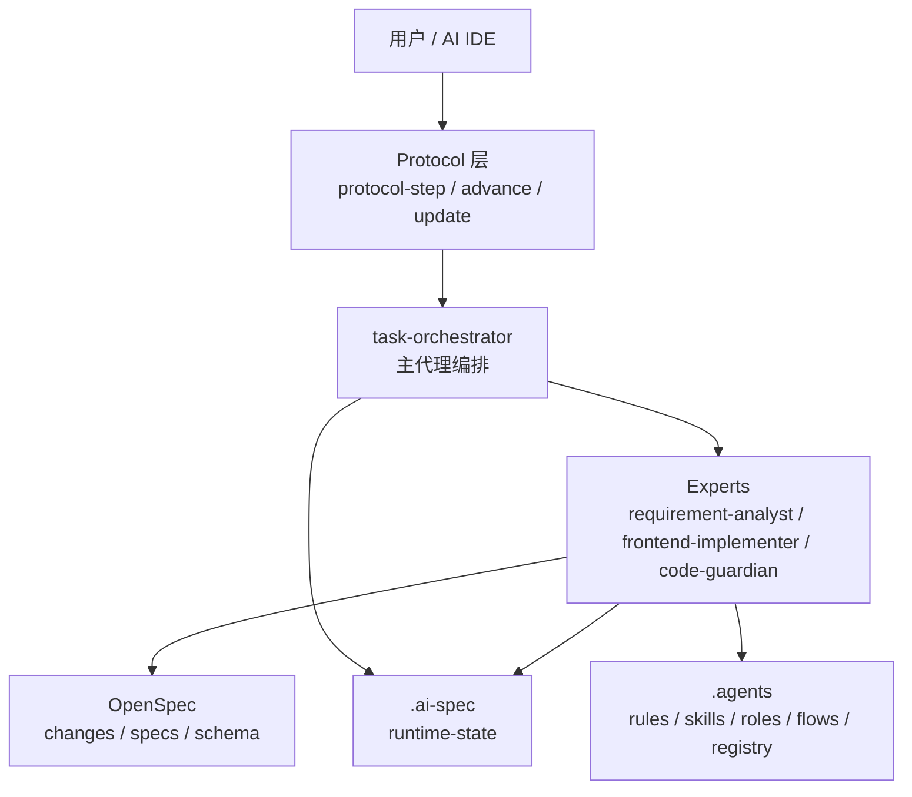
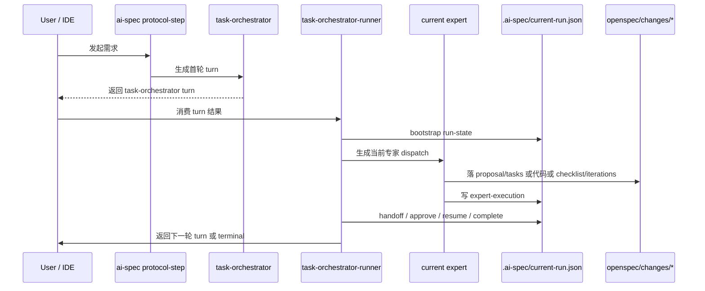

# 项目介绍与运行机制说明

## 1. 这是什么项目

`br-ai-spec` 当前阶段的目标，不是做一个“大而全的平台配置器”，而是先做一个**基于 OpenSpec 的专家协同式 AI 规范驱动开发底座**。

它解决的是下面这件事：

- 在目标项目里接入 `OpenSpec`
- 让 AI 不再“自由发挥写代码”
- 而是按 `rules + skills + experts + runtime` 的约束完成一条真实交付链

当前这条主链固定为：

`requirement-analyst -> frontend-implementer -> code-guardian`

也就是：

- 先收敛需求
- 再执行实现
- 最后做交付守护

当前阶段的重点不是 Hub、插件层、OpenClaw、可观测，而是先把这条底层主链跑通。

---

## 2. 当前阶段的核心目标

当前阶段只做 4 件核心事情：

1. 用 `OpenSpec` 承接需求与交付产物
2. 用 `rules` 和 `skills` 约束专家怎么工作
3. 用 `task-orchestrator` 编排专家交接和审批门禁
4. 用 `.ai-spec` 记录最小运行态，支撑恢复、推进和结束

当前阶段明确不优先做：

- 插件主入口
- Hub 资产平台对接
- 按域安装 / 按流程安装
- OpenClaw 自动化流水线
- 团队级可观测平台

这些方向是未来融合项，不是当前地基。

---

## 3. 项目如何分层

当前项目可以按 4 层理解。



### 3.1 OpenSpec 原生层

职责：

- 管理 `openspec/changes/` 和 `openspec/specs/`
- 承接 `proposal.md / tasks.md / checklist.md / iterations.md`
- 作为需求和交付产物的底座

关键目录：

- `openspec/config.yaml`
- `openspec/schemas/expert-delivery/`
- `openspec/changes/`
- `openspec/specs/`

### 3.2 平台契约层

职责：

- 描述规则、技能、角色、流程模板
- 告诉专家应该读什么、写什么、按什么顺序执行

关键目录：

- `.agents/rules/`
- `.agents/skills/`
- `.agents/roles/`
- `.agents/flows/`
- `.agents/registry/`

### 3.3 运行时编排层

职责：

- 记录当前 run 在哪个阶段
- 记录当前专家、待审批门禁、目标产物、事件历史
- 支持 handoff、approve、resume、complete

关键目录：

- `.ai-spec/current-run.json`
- `.ai-spec/internal/`

### 3.4 适配分发层

职责：

- 安装规范到目标项目
- 对接不同 IDE
- 同步 OpenSpec 配置和 schema

关键入口：

- `install.sh`
- `install.ps1`
- `bin/cli.js`

---

## 4. 当前项目里的关键目录

### 4.1 `.agents/`

这是规则和专家协议的单一维护源。

- `rules/`
  声明式约束，定义不能乱做什么
- `skills/`
  过程式能力，定义应该如何做
- `roles/`
  专家角色说明，定义谁负责什么
- `flows/`
  协作模板，定义主链顺序和门禁
- `registry/`
  最小元数据注册表，避免把路径和角色配置硬编码在执行器里

### 4.2 `openspec/`

这是需求与交付产物底座。

当前已经补了 `expert-delivery` schema，主链正式产物包括：

- `proposal.md`
- `design.md`
- `tasks.md`
- `spec.md`
- `checklist.md`
- `iterations.md`

### 4.3 `.ai-spec/`

这是运行态目录，不是业务代码目录。

它负责保存：

- 当前 run 的状态
- 当前 dispatch
- 当前 expert execution
- 审批门禁和历史事件

### 4.4 `bin/` 与 `internal/`

这是当前底层执行逻辑所在位置。

- `bin/cli.js`
  统一 CLI 入口
- `bin/protocol-workflow.js`
  对外暴露 `protocol-step / protocol-advance / protocol-update`
- `internal/ai-protocol-workflow.js`
  负责生成当前 turn
- `bin/task-orchestrator-runner.js`
  负责消费 inbox、推进 runtime、自动交接
- `bin/expert-executor.js`
  负责把专家执行结果映射成 runtime mutation
- `bin/runtime-state.js`
  负责最小运行态读写

---

## 5. 这个项目是怎么运作的

当前最重要的是理解：**这个项目不是让 AI 直接写代码，而是让 AI 先进入协议轮次。**

真实路径如下：



可以把它拆成 6 步理解：

### 5.1 用户发起需求

例如：

```bash
ai-spec protocol-step --target . --user-input "新增一个商品 mock 页面" --json
```

这一步不是直接开发，而是先生成当前轮次的 `turn`。

### 5.2 `task-orchestrator` 生成首轮编排

主代理会根据：

- 当前项目技术栈
- `.agents/flows/common/prd-to-delivery.md`
- `.agents/registry/*.json`
- `openspec/config.yaml`

决定：

- 当前任务是 `micro` 还是 `standard`
- 第一跳应该给哪个专家
- 是否需要审批门禁
- 当前轮次应该读哪些文件、写哪些文件

### 5.3 Runner 建立运行态

当首轮 turn 被消费后，Runner 会建立：

- `.ai-spec/current-run.json`
- 当前 dispatch
- 当前 execution inbox

这个阶段意味着“流程正式启动”。

### 5.4 当前专家执行自己的轮次

不同专家只允许做自己职责内的事：

- `requirement-analyst`
  只产出 `proposal.md`、`tasks.md`
- `frontend-implementer`
  才允许改业务代码
- `code-guardian`
  只产出 `checklist.md`、`iterations.md`

专家执行完成后，不是直接自然语言汇报结束，而是要写结构化执行结果。

### 5.5 `expert-executor` 推进运行态

`expert-executor` 会把专家结果映射为 OpenSpec 语义动作和运行态动作。

当前主映射是：

- `requirement-analyst -> propose`
- `frontend-implementer -> apply`
- `code-guardian -> verify`
- 最终完成态带 `archive` 语义

### 5.6 Runner 自动交接到下一位专家或结束

当产物齐全、门禁满足时：

- 需求专家交给实现专家
- 实现专家交给守护专家
- 守护专家结束 run

最终 `current-run.json.status = success` 才算主链闭环完成。

---

## 6. 当前主流程是怎样定义的

当前主流程模板在：

- `.agents/flows/common/prd-to-delivery.md`

它定义了当前最小主链：

1. `requirement-analyst`
2. `frontend-implementer`
3. `code-guardian`

并定义了两个默认门禁：

- `before-implementation`
- `before-delivery`

它还明确了当前最小交付物：

- `proposal.md`
- `tasks.md`
- 代码实现
- `checklist.md`
- `iterations.md`

这意味着当前阶段项目的核心不是“很多专家”，而是“先把三专家主链跑稳”。

---

## 7. 当前运行态里最重要的文件

### 7.1 `.ai-spec/current-run.json`

这是最重要的运行态文件。

你可以把它理解成：

- 当前任务是谁发起的
- 当前执行到哪个专家
- 当前状态是什么
- 当前 change_id 是什么
- 当前已经沉淀了哪些产物
- 事件历史走到了哪一步

### 7.2 `.ai-spec/internal/tmp/*`

这是中间 inbox，不是长期文档。

主要包括：

- task-orchestrator turn
- current dispatch
- current execution
- runtime action

这些文件的意义是“当前轮次怎么推进”，不是业务交付物本身。

### 7.3 `openspec/changes/<change-id>/`

这是本次任务真正的交付落点。

当前阶段最重要的，是确保这个目录里的产物真实落盘，而不是只在内存里说“已经完成”。

---

## 8. 当前最重要的几个命令

对外最重要的是 5 个命令。

### 8.1 启动一轮新需求

```bash
ai-spec protocol-step --target . --user-input "新增一个商品 mock 页面" --json
```

### 8.2 推进当前流程

```bash
ai-spec protocol-advance --target . --json
```

### 8.3 更新当前用户补充或审批意见

```bash
ai-spec protocol-update --target . --user-input "同意继续实现" --json
```

### 8.4 校验注册表

```bash
ai-spec validate-registry
```

### 8.5 查看/维护运行态

```bash
ai-spec runtime-state status --target .
```

需要注意：

- `task-orchestrator-runner`
- `expert-executor`

这两个更偏内部运行模块，不是最终面对普通使用者的主入口。

---

## 9. 当前阶段你应该怎么理解这个项目

如果用一句最容易记住的话来概括：

> `OpenSpec` 负责管产物，`rules/skills` 负责管专家执行，`task-orchestrator` 负责管流程，`.ai-spec` 负责管状态。

再进一步说：

- 它不是“AI 自由写代码工具”
- 它也不是“复杂资产平台”
- 它是一个“让 AI 专家按规范完成交付”的最小执行底座

所以当前阶段判断一个改动是否正确，可以只问一个问题：

> 这个改动是不是让三专家主链更容易真实跑通？

如果答案是：

- 是
  说明大概率值得做
- 不是
  大概率就属于后续融合项，不应进入当前优先级

---

## 10. 当前阶段之后会接什么

未来确实会接入这些方向：

- Hub 资产平台
- 插件层与页面化安装
- 按域安装 / 按流程安装
- OpenClaw 自动化流水线
- 可观测平台

但这些都应建立在当前底层已经稳定的前提上。

正确顺序是：

1. 先把当前底层主链做实
2. 先跑通一个真实示例
3. 再做 Hub / 插件 / OpenClaw / 可观测的融合

---

## 11. 当前最推荐的下一步

从当前仓库状态出发，最合理的下一步不是继续补概念，而是：

**做一个最小示例工程，真实跑通一次 `micro` 主链。**

建议示例范围固定为：

- 技术栈：Vue
- 场景：新增一个商品 mock 页面或组件
- 档位：micro
- 主链：`requirement-analyst -> frontend-implementer -> code-guardian`

验收只看：

- `proposal.md` 是否落盘
- `tasks.md` 是否落盘
- `checklist.md` 是否落盘
- `iterations.md` 是否落盘
- `.ai-spec/current-run.json` 是否进入 `success`

这条示例一旦跑通，后面的 Hub、插件、OpenClaw 才有坚实底座。
