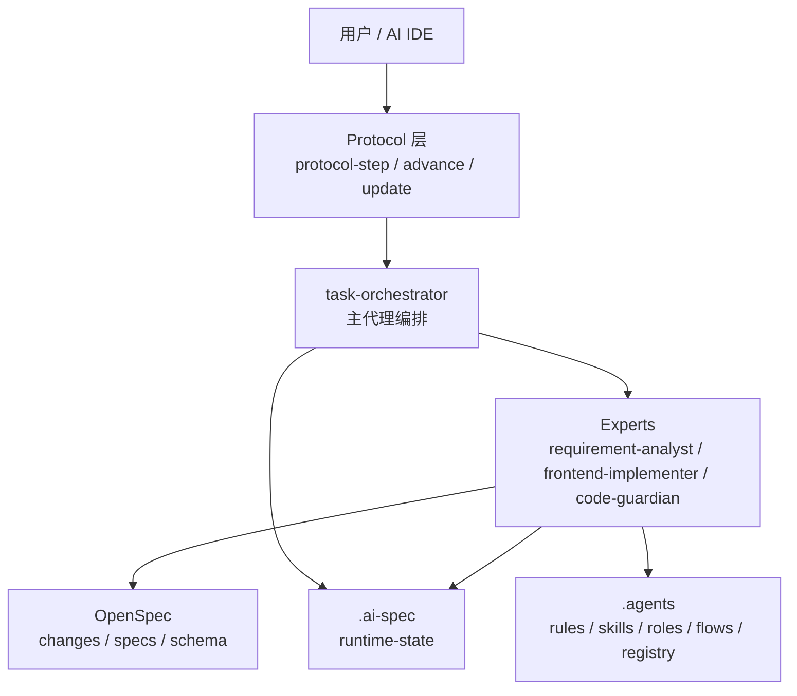
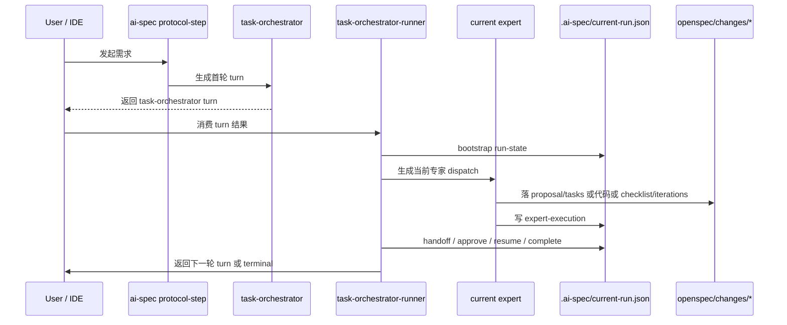

# OpenSpec 最佳实践：项目介绍、运行机制与落地指南

## 0. 这篇文章能不能作为团队最佳实践材料

可以，但更准确的定位应当是：

- 它不是单纯的“项目介绍”
- 也不是只讲概念的“方案说明”
- 而是团队成员进入 `br-ai-spec` 之前必须先读的一篇**最佳实践与上手指南**

如果后续要在 works 插件里挂一篇“最佳实践参考文章”，这篇文档可以直接作为基础稿，但前提是它必须同时回答 4 个问题：

1. `OpenSpec` 官方推荐的工作方式是什么
2. 当前项目在 `OpenSpec` 之上增强了什么
3. `openspec/config.yaml` 应该怎么配，边界在哪里
4. 团队成员第一次进入仓库时，应该先看哪些目录、命令和接口

这次整理后的版本，就是按这个目标来写的。

配套阅读建议：

- 如果你是第一次接触项目，先读 [团队成员 5 分钟上手](./团队成员5分钟上手.md)
- 如果你需要维护 `config.yaml` 或规则协作，再读 [OpenSpec配置与协作深入版](./OpenSpec配置与协作深入版.md)

---

## 1. 先建立一个统一认知

`br-ai-spec` 当前阶段的目标，不是做一个“大而全的平台配置器”，而是先做一个**基于 OpenSpec 的专家协同式 AI 规范驱动开发底座**。

它解决的是下面这件事：

- 在目标项目里接入 `OpenSpec`
- 让 AI 不再“自由发挥写代码”
- 而是按 `OpenSpec + rules + skills + experts + runtime` 的约束完成一条真实交付链

当前主链固定为：

`requirement-analyst -> frontend-implementer -> code-guardian`

也就是：

- 先收敛需求
- 再执行实现
- 最后做交付守护

当前阶段重点不是 Hub、插件层、OpenClaw、团队级可观测，而是先把这条底层主链跑通。

---

## 2. OpenSpec 的官方最佳实践，对这个项目意味着什么

结合 OpenSpec 当前官方公开资料，可以把最重要的实践原则概括成 6 条：

1. **先做变更提案，再进入实现**
   `OpenSpec` 当前主推的是 artifact-guided workflow，标准入口仍是 `propose -> apply -> archive`。
2. **规范要跟代码一起留在仓库里**
   `openspec/specs/` 不是临时草稿区，而是长期上下文库，新同学和新会话都应从这里获取系统意图。
3. **流程要轻，不要把规范做成重流程**
   OpenSpec 官方强调的是 lightweight、iterative、brownfield-first，不是一次性做完所有设计。
4. **先对齐意图，再写代码**
   `proposal.md / design.md / tasks.md / spec delta` 的意义是让评审先审“要做什么”和“为什么这样做”，不是只看代码 diff。
5. **上下文要干净**
   官方明确提到 `context hygiene`，也就是开始实现前尽量清理会话噪音，避免 AI 被无关上下文带偏。
6. **OpenSpec 升级后要刷新项目内指令**
   官方建议升级后在项目内执行 `openspec update`，确保最新 slash commands 和 agent instructions 生效。

对当前项目的直接推论是：

- `OpenSpec` 负责“变更产物与节奏”
- `br-ai-spec` 负责“把团队规范注入到每个阶段”
- 最佳实践不是在 `OpenSpec` 外再造一套流程，而是**把增强层挂在 OpenSpec 的三阶段之上**

---

## 3. 当前阶段的核心目标

当前阶段只做 4 件核心事情：

1. 用 `OpenSpec` 承接需求与交付产物
2. 用 `rules` 和 `skills` 约束专家怎么工作
3. 用 `task-orchestrator` 编排专家交接和审批门禁
4. 用 `.ai-spec` 记录最小运行态，支撑恢复、推进和结束

当前阶段明确不优先做：

- 插件主入口
- Hub 资产平台对接
- 按域安装 / 按流程安装
- OpenClaw 自动化流水线
- 团队级可观测平台

这些方向是未来融合项，不是当前地基。

---

## 4. 这个项目如何分层

当前项目可以按 4 层理解。



### 4.1 OpenSpec 原生层

职责：

- 管理 `openspec/changes/` 和 `openspec/specs/`
- 承接 `proposal.md / tasks.md / checklist.md / iterations.md`
- 作为需求和交付产物的底座

关键目录：

- `openspec/config.yaml`
- `openspec/schemas/expert-delivery/`
- `openspec/changes/`
- `openspec/specs/`

### 4.2 平台契约层

职责：

- 描述规则、技能、角色、流程模板
- 告诉专家应该读什么、写什么、按什么顺序执行

关键目录：

- `.agents/rules/`
- `.agents/skills/`
- `.agents/roles/`
- `.agents/flows/`
- `.agents/registry/`

### 4.3 运行时编排层

职责：

- 记录当前 run 在哪个阶段
- 记录当前专家、待审批门禁、目标产物、事件历史
- 支持 handoff、approve、resume、complete

关键目录：

- `.ai-spec/current-run.json`
- `.ai-spec/internal/`

### 4.4 适配分发层

职责：

- 安装规范到目标项目
- 对接不同 IDE
- 同步 OpenSpec 配置和 schema

关键入口：

- `install.sh`
- `install.ps1`
- `bin/cli.js`

---

## 5. `config.yaml` 最佳实践：怎么配，为什么这么配

对当前仓库来说，`openspec/config.yaml` 的推荐思路不是“写得越多越好”，而是：

- `schema` 只负责定义产物结构
- `context` 只写项目事实和执行优先级
- `rules` 只写阶段约束，不把完整执行手册塞进去
- 具体做法交给 `.agents/rules/` 和 `.agents/skills/`

推荐模板如下：

```yaml
schema: expert-delivery

context: |
  本项目接入 ex-ai-spec 专家协同平台：
  - rules: .agents/rules/
  - skills: .agents/skills/
  - roles: .agents/roles/
  - flows: .agents/flows/
  - runtime: .ai-spec/

  项目执行时优先遵循：
  1. 仓库现有代码中的目录、路由、接口、样式、测试约定
  2. context/PROJECT.md 中的项目背景与仓库事实
  3. .agents/rules/ 中的团队规范
  4. .agents/skills/ 中的执行技能

rules:
  proposal:
    - "先收敛目标、范围、非目标项、默认假设和风险，再进入实现。"
    - "能从项目规则和代码推断的内容，优先写入 assumptions，不重复标记为缺失输入。"
    - "涉及页面、路由、接口、状态、样式时，必须对齐项目既有落点。"
  specs:
    - "需求必须落为可测试的增量规范和场景。"
    - "涉及 UI 时，验收场景应覆盖关键布局、状态和交互。"
    - "涉及安装脚本、路径、运行态文件、归档或 IDE 适配时，必须明确 macOS / Linux / Windows 的行为差异与兼容边界。"
    - "涉及产物生成、同步或删除时，必须明确目标定位依据，优先使用显式清单、注册表或固定映射，不依赖模糊模式匹配。"
  tasks:
    - "任务必须可执行、可验证、可交接。"
    - "实现阶段不得静默扩 scope。"
    - "涉及 UI 时必须明确验收方式；涉及接口时必须明确封装方式。"
    - "保持改动最小化，聚焦于请求的变更。"
    - "涉及安装、路径、runtime、归档或 IDE 适配时，必须包含跨平台验证任务。"
  design:
    - "技术方案必须对齐项目目录、路由、API、状态、样式和测试约定。"
    - "新增能力优先复用现有结构，不因单次变更引入无关重构。"
    - "涉及路径处理时，必须使用跨平台路径能力，不硬编码路径分隔符。"
    - "优先复用现有 registry、常量和显式映射，不引入启发式检测、模糊匹配或正则猜测。"
  checklist:
    - "必须明确通过项、未通过项、阻断项和是否建议放行。"
    - "检查结论必须基于 proposal/tasks、项目规则和实现证据。"
  iterations:
    - "必须记录问题、修正动作、残留风险和下轮提醒。"
```

### 5.1 `schema` 怎么配

当前推荐固定为：

```yaml
schema: expert-delivery
```

原因不是“必须自定义 schema 才高级”，而是因为当前项目不是只需要 `proposal/design/tasks/specs`，还需要：

- `checklist.md`
- `iterations.md`
- 后续可能继续扩展专家交付字段

所以这里的最佳实践是：

- **结构性产物**放进 `schema`
- **行为性约束**放进 `rules`
- **具体执行方法**放进 `.agents/skills/`

### 5.2 `context` 怎么配

`context` 的职责是告诉 OpenSpec：

- 当前项目接了哪些增强层
- 这些增强层在哪里
- 执行时优先级应该怎么排

最佳实践有 3 条：

1. 只写事实，不写长篇方法论
2. 把“先读现有项目约定”放在前面，而不是先读技能
3. 明确 `.agents` 和 `.ai-spec` 的入口，降低 AI 漏读概率

不建议把下面这些内容硬塞进 `context`：

- 大段流程教学
- 过细的实现步骤
- 大量 role 说明
- 可从 `.agents/rules/` 直接读取的重复内容

这里要特别注意：

- 像“路径怎么处理”“哪些场景必须补跨平台验证”这类只在特定 artifact 生效的约束，更适合放进 `rules`
- 不要因为这些约束重要，就把它们整体前移到 `context`

### 5.3 `rules` 怎么配

`rules` 不是为了替代 skill，而是为了告诉 OpenSpec 在每个阶段产物里**至少要体现什么约束**。

结合当前项目和 OpenSpec 默认配置的可借鉴部分，当前模板里的 `rules` 重点覆盖 4 类内容：

1. 提案与任务边界
2. 可测试性与验收场景
3. 跨平台与路径处理约束
4. 显式映射优先于模糊匹配

推荐写法：

- `proposal` 只管目标、范围、假设、风险
- `specs` 负责可测试性、验收场景，以及在安装/路径/runtime/归档/IDE 适配场景下明确跨平台行为边界
- `tasks` 负责任务粒度、边界、验证方式，以及在相关变更中补出跨平台验证任务
- `design` 负责结构对齐与复用策略，同时要求路径处理跨平台、目标定位显式、避免启发式或模糊匹配
- `checklist / iterations` 只管交付审查结论

当前这版相比之前多出来的两类约束，建议团队明确记住：

- **跨平台约束**
  适用于安装脚本、路径处理、运行态文件、归档逻辑、IDE 适配这类天然容易受 macOS / Linux / Windows 差异影响的改动
- **显式定位约束**
  适用于生成、同步、删除、归档、注册表查找这类动作；推荐用显式清单、固定映射或 registry，不依赖正则猜测和模糊扫描

不推荐的写法：

- 在 `tasks.rules` 里直接写成几十条流程脚本
- 把每个技能名都塞进 `config.yaml`
- 把一个团队的全部工程规范都复制到 `rules`

一句话：

> `config.yaml` 负责“定边界”，`.agents` 负责“给做法”。

---

## 6. `config.yaml` 与 rules / skills 的配合方式

这是团队最容易写乱的地方，建议固定按下面分工理解。

| 层 | 负责什么 | 应该放什么 | 不应该放什么 |
|----|----------|------------|--------------|
| `openspec/config.yaml` | OpenSpec 阶段约束与上下文桥接 | `schema`、阶段级 rules、项目事实 | 冗长流程脚本、整套技能正文 |
| `.agents/rules/` | 团队硬约束 | 目录约定、命名约定、边界条件、禁止项 | 过长的操作步骤 |
| `.agents/skills/` | 具体执行方法 | API 创建、组件创建、提案增强、测试编写、验收流程 | 与项目无关的抽象口号 |
| `.agents/flows/` | 专家交接顺序 | 主链顺序、门禁、交付物要求 | 具体文件实现细节 |
| `.agents/roles/` | 角色边界 | 谁负责什么、不能做什么 | 全局流程编排 |

### 6.1 推荐协作路径

推荐固定为：

1. `config.yaml` 告诉 OpenSpec 当前项目有 `.agents`
2. `proposal/design/tasks` 在生成时先吸收 `config.yaml.rules`
3. 进入实现后，再由 `.agents/rules/` 和 `.agents/skills/` 接管细节
4. `task-orchestrator` 根据 `.agents/flows/` 与 `.agents/registry/` 做交接和门禁
5. `.ai-spec` 持久化当前运行态

### 6.2 一个容易记住的分工

- `OpenSpec` 管“变更产物”
- `rules` 管“不能乱做什么”
- `skills` 管“应该怎么做”
- `flows` 管“谁先谁后”
- `runtime` 管“现在做到哪一步”

如果后面要在 works 插件里新增“最佳实践文章参考”，建议就用这套分工作为文章的核心骨架。

---

## 7. 项目目录介绍：团队成员第一次该看什么

如果把这个仓库当成一个团队交付底座，新同学第一次进入项目，建议按下面顺序理解目录。

### 7.1 根目录总览

```text
br-ai-spec/
├── .agents/          # 团队规则、技能、角色、流程、注册表
├── bin/              # CLI 与运行模块入口
├── internal/         # 协议轮次与编排实现
├── openspec/         # OpenSpec 配置、schema、changes、specs
├── configs/          # 安装与 profile 侧配置模板
├── docs/             # 项目文档与阶段说明
├── scripts/          # 调试与辅助脚本
├── tests/            # 运行时与注册表测试
├── templates/        # 安装模板与上下文模板
└── README.md         # 对外入口说明
```

### 7.2 `.agents/`：团队约束中心

这是规则和专家协议的单一维护源。

- `rules/`
  声明式约束，定义不能乱做什么
- `skills/`
  过程式能力，定义应该如何做
- `roles/`
  专家角色说明，定义谁负责什么
- `flows/`
  协作模板，定义主链顺序和门禁
- `registry/`
  最小元数据注册表，避免把路径和角色配置硬编码在执行器里

团队成员如果只读一个目录，优先读这里。

### 7.3 `openspec/`：需求与交付产物底座

这里是 OpenSpec 原生资产和增强 schema 所在位置。

当前重点关注：

- `config.yaml.template`
  安装时下发到目标项目的推荐配置模板
- `schemas/expert-delivery/`
  当前主链使用的项目级 schema
- `changes/`
  进行中的变更与归档历史
- `specs/`
  长期有效的能力规范库

### 7.4 `bin/` 与 `internal/`：运行逻辑入口

这里存放当前底层执行逻辑。

- `bin/cli.js`
  统一 CLI 入口
- `bin/protocol-workflow.js`
  对外暴露 `protocol-step / protocol-advance / protocol-update`
- `internal/ai-protocol-workflow.js`
  负责生成当前 `turn`
- `bin/task-orchestrator-runner.js`
  负责消费 inbox、推进 runtime、自动交接
- `bin/expert-executor.js`
  负责把专家执行结果映射成 runtime mutation
- `bin/runtime-state.js`
  负责最小运行态读写

### 7.5 `.ai-spec/`：运行态目录

这是运行态目录，不是业务代码目录。

它负责保存：

- 当前 run 的状态
- 当前 dispatch
- 当前 expert execution
- 审批门禁和历史事件

如果有人问“流程卡住了，现在做到哪一步”，先看这里。

---

## 8. 接口介绍：团队成员需要知道哪些对外接口

这里的“接口”建议分成两类理解：**对外 CLI 接口**和**内部运行接口**。

### 8.1 对外 CLI 接口

对团队日常使用最重要的是 5 个命令。

#### 1. 启动一轮新需求

```bash
ai-spec protocol-step --target . --user-input "新增一个商品 mock 页面" --json
```

作用：

- 创建当前协议轮次
- 判断任务档位
- 决定第一位专家和首轮门禁

#### 2. 推进当前流程

```bash
ai-spec protocol-advance --target . --json
```

作用：

- 消费当前专家结果
- 根据门禁与产物情况推进到下一步

#### 3. 更新用户补充或审批意见

```bash
ai-spec protocol-update --target . --user-input "同意继续实现" --json
```

作用：

- 在运行过程中补充需求
- 给出审批结论
- 驱动当前流程继续推进

#### 4. 校验注册表

```bash
ai-spec validate-registry
```

作用：

- 校验角色、流程、注册表之间是否一致

#### 5. 查看运行态

```bash
ai-spec runtime-state status --target .
```

作用：

- 查看当前 run、当前专家、当前状态、当前 change_id

### 8.2 内部运行接口

下面这些模块重要，但不建议普通使用者直接把它们当作主入口：

- `task-orchestrator-runner`
  内部 runtime 推进器
- `expert-executor`
  专家结果到 runtime 动作的转换器
- `internal/ai-protocol-workflow.js`
  负责形成当前 turn 和执行契约

最佳实践是：

- 普通团队成员只认 `protocol-step / protocol-advance / protocol-update`
- 平台开发者再去理解 `runner / executor / runtime-state`

这样边界更清楚，也更利于对外培训。

---

## 9. 这个项目是怎么运作的

当前最重要的是理解：**这个项目不是让 AI 直接写代码，而是让 AI 先进入协议轮次。**

真实路径如下：



可以把它拆成 6 步理解。

### 9.1 用户发起需求

例如：

```bash
ai-spec protocol-step --target . --user-input "新增一个商品 mock 页面" --json
```

这一步不是直接开发，而是先生成当前轮次的 `turn`。

### 9.2 `task-orchestrator` 生成首轮编排

主代理会根据：

- 当前项目技术栈
- `.agents/flows/common/prd-to-delivery.md`
- `.agents/registry/*.json`
- `openspec/config.yaml`

决定：

- 当前任务是 `micro` 还是 `standard`
- 第一跳应该给哪个专家
- 是否需要审批门禁
- 当前轮次应该读哪些文件、写哪些文件

### 9.3 Runner 建立运行态

当首轮 turn 被消费后，Runner 会建立：

- `.ai-spec/current-run.json`
- 当前 dispatch
- 当前 execution inbox

这个阶段意味着“流程正式启动”。

### 9.4 当前专家执行自己的轮次

不同专家只允许做自己职责内的事：

- `requirement-analyst`
  只产出 `proposal.md`、`tasks.md`
- `frontend-implementer`
  才允许改业务代码
- `code-guardian`
  只产出 `checklist.md`、`iterations.md`

专家执行完成后，不是直接自然语言汇报结束，而是要写结构化执行结果。

### 9.5 `expert-executor` 推进运行态

`expert-executor` 会把专家结果映射为 OpenSpec 语义动作和运行态动作。

当前主映射是：

- `requirement-analyst -> propose`
- `frontend-implementer -> apply`
- `code-guardian -> verify`
- 最终完成态带 `archive` 语义

### 9.6 Runner 自动交接到下一位专家或结束

当产物齐全、门禁满足时：

- 需求专家交给实现专家
- 实现专家交给守护专家
- 守护专家结束 run

最终 `current-run.json.status = success` 才算主链闭环完成。

---

## 10. 当前主流程是怎样定义的

当前主流程模板在：

- `.agents/flows/common/prd-to-delivery.md`

它定义了当前最小主链：

1. `requirement-analyst`
2. `frontend-implementer`
3. `code-guardian`

并定义了两个默认门禁：

- `before-implementation`
- `before-delivery`

它还明确了当前最小交付物：

- `proposal.md`
- `tasks.md`
- 代码实现
- `checklist.md`
- `iterations.md`

这意味着当前阶段项目的核心不是“很多专家”，而是“先把三专家主链跑稳”。

---

## 11. 当前运行态里最重要的文件

### 11.1 `.ai-spec/current-run.json`

这是最重要的运行态文件。

你可以把它理解成：

- 当前任务是谁发起的
- 当前执行到哪个专家
- 当前状态是什么
- 当前 change_id 是什么
- 当前已经沉淀了哪些产物
- 事件历史走到了哪一步

### 11.2 `.ai-spec/internal/tmp/*`

这是中间 inbox，不是长期文档。

主要包括：

- task-orchestrator turn
- current dispatch
- current execution
- runtime action

这些文件的意义是“当前轮次怎么推进”，不是业务交付物本身。

### 11.3 `openspec/changes/<change-id>/`

这是本次任务真正的交付落点。

当前阶段最重要的，是确保这个目录里的产物真实落盘，而不是只在内存里说“已经完成”。

---

## 12. 团队落地时的推荐阅读顺序

如果这篇文章要给团队成员阅读，建议按下面顺序理解：

1. 先读第 1、2 节，建立 `OpenSpec` 与 `br-ai-spec` 的边界认知
2. 再读第 5、6 节，理解 `config.yaml` 和 rules / skills 的协作方式
3. 再读第 7、8 节，知道目录和接口从哪里入手
4. 最后读第 9、10、11 节，理解运行机制和运行态

这样读下来，新成员至少会知道：

- 为什么不是让 AI 直接自由写代码
- 为什么 `config.yaml` 不能写成另一本规则手册
- 为什么 `.agents` 才是团队规范中心
- 为什么 `.ai-spec` 是运行事实来源

---

## 13. 当前阶段之后会接什么

未来确实会接入这些方向：

- Hub 资产平台
- 插件层与页面化安装
- 按域安装 / 按流程安装
- OpenClaw 自动化流水线
- 可观测平台

但这些都应建立在当前底层已经稳定的前提上。

正确顺序是：

1. 先把当前底层主链做实
2. 先跑通一个真实示例
3. 再做 Hub / 插件 / OpenClaw / 可观测的融合

---

## 14. 当前最推荐的下一步

从当前仓库状态出发，最合理的下一步不是继续补概念，而是：

**做一个最小示例工程，真实跑通一次 `micro` 主链。**

建议示例范围固定为：

- 技术栈：Vue
- 场景：新增一个商品 mock 页面或组件
- 档位：micro
- 主链：`requirement-analyst -> frontend-implementer -> code-guardian`

验收只看：

- `proposal.md` 是否落盘
- `tasks.md` 是否落盘
- `checklist.md` 是否落盘
- `iterations.md` 是否落盘
- `.ai-spec/current-run.json` 是否进入 `success`

这条示例一旦跑通，后面的 Hub、插件、OpenClaw 才有坚实底座。

---

## 15. 最后给团队一个一句话总结

如果只记一句话，建议统一记成下面这句：

> `OpenSpec` 负责管变更产物，`.agents` 负责管专家执行，`task-orchestrator` 负责管流程，`.ai-spec` 负责管运行状态。

这句话既能作为团队培训口径，也适合放到 works 插件里的“最佳实践文章”摘要位置。
